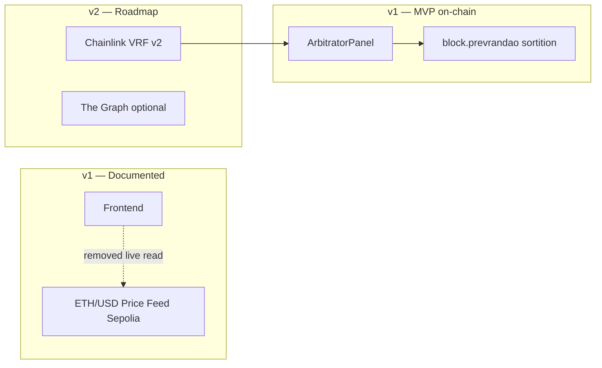
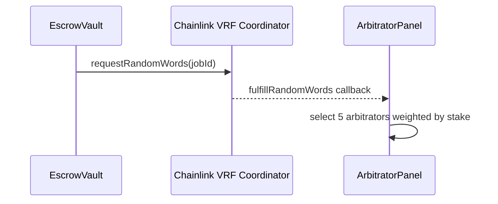

# Chainlink — FAPEX

> **English summary:** Chainlink ETH/USD feed is documented for Sepolia but not shown live in UI. VRF sortition is deferred to v2; MVP uses `block.prevrandao` with stake gates.

**Cập nhật:** 2026-06-30

---

## Tổng quan tích hợp



| Thành phần Chainlink | Trạng thái | Ghi chú |
|---------------------|------------|---------|
| **ETH/USD Price Feed** | Code có, **UI không hiển thị live** | Landing stats ghi "Oracle: Chainlink" |
| **VRF sortition** | **Deferred v2** | Stub `contracts/chainlink/VRFSortitionStub.sol` |
| **CCIP** | Không trong scope | — |
| **Chainlink Functions** | Không trong scope | — |

---

## 1. ETH/USD Price Feed (Sepolia)

| Thuộc tính | Giá trị |
|------------|---------|
| Network | Sepolia |
| Feed address | `0x694AA1769357215DE4FAC081bf1f309aDC325306` |
| Env (optional) | `VITE_ETH_USD_FEED=0x694AA1769357215DE4FAC081bf1f309aDC325306` |

### Đã implement (code)

- `frontend/src/lib/chainlink/priceFeeds.ts` — AggregatorV3 ABI
- Hook `useEthUsdPrice` (có thể bật lại)

### Trạng thái production (2026-06)

**Live ETH price feed đã gỡ khỏi UI** để:
- Giảm RPC calls trên Vercel client
- Tập trung scope đồ án vào escrow/dispute

**Khi demo:** Giải thích feed vẫn có trên Sepolia; có thể bật lại bằng env + hook. Landing ticker vẫn mention Chainlink oracle.

---

## 2. VRF sortition (deferred v2)

### Hiện tại (MVP)

`ArbitratorPanel._selectPanel`:

```solidity
// Pseudocode
seed = keccak256(block.prevrandao, block.timestamp, jobId, round, initiator);
// Chọn 5 arbitrator từ pool, loại client/freelancer/round trước
```

**Bảo vệ kinh tế:** stake 50 USDC, slash no-reveal, reputation gate.

### v2 đề xuất



**Stub:** `contracts/chainlink/VRFSortitionStub.sol`

```solidity
interface IVRFSortitionConsumer {
    function requestArbitratorSortition(uint256 jobId) external;
    function fulfillArbitratorSortition(uint256 jobId, uint256[] memory randomWords) external;
}
```

**Chưa deploy** trên Sepolia hiện tại.

### Tại sao chưa VRF? (Q&A)

| Lý do | Chi tiết |
|-------|----------|
| Độ phức tạp | Subscription LINK, callback gas, async latency |
| Deadline đồ án | Prevrandao + stake đủ demo Sepolia |
| Chi phí | VRF request per dispute tốn LINK testnet |

Xem: [demo-qa-defense-vi.md](demo-qa-defense-vi.md)

---

## 3. Không nằm trong v1

| Dịch vụ | Lý do |
|---------|-------|
| CCIP | Single-chain Sepolia đủ scope |
| Functions | Evidence đã dùng IPFS + hash on-chain |
| Automation | Manual `executeArbitrationResult` — keeper v2 |

---

## 4. Kiểm thử price feed (dev)

```bash
cd frontend
# Bật VITE_ETH_USD_FEED trong .env
npm run dev
# Mở / — nếu hook được wire lại sẽ thấy ETH price
```

---

## Tài liệu liên quan

- [tech-stack-vi.md](tech-stack-vi.md)
- [issue-audit-status-vi.md](issue-audit-status-vi.md) — CL-1, CL-2
- [dispute-kleros-comparison-vi.md](dispute-kleros-comparison-vi.md)
