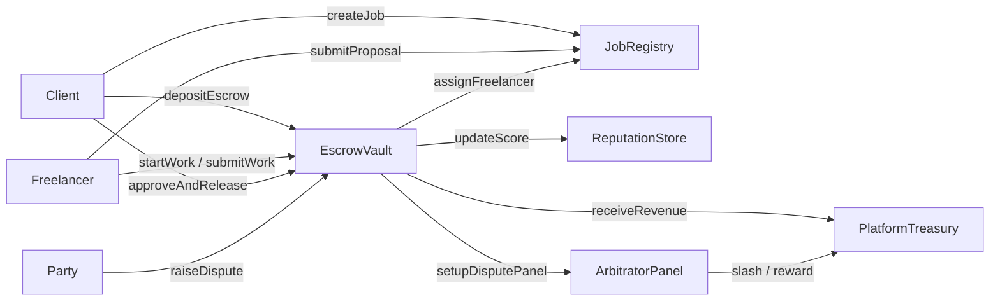

# Hướng dẫn tương tác Smart Contract — Fapex

> **Network:** Sepolia (`chainId: 11155111`)  
> **Deploy:** 2026-06-21 — role delegation + gas optimizations  
> **Repo:** [thanhltkk24414-lang/Blockchain](https://github.com/thanhltkk24414-lang/Blockchain)

---

## 1. Địa chỉ Sepolia (mới nhất)

| Contract | Address |
|----------|---------|
| MockUSDC | `0x2293193Eaa5CE5253d5e081046a06dB077f26f8e` |
| ReputationStore | `0x7A96219812e9363dBdbD43BE14384820E5f9b0DC` |
| PlatformTreasury | `0x0110BfF85E484b82205833D3950fC7C61714c0e7` |
| JobRegistry | `0xeF5cc7a22D7Ff9e7FA0c5Fe714F088c98758A549` |
| ArbitratorPanel | `0x324e7d8Cfe5aBdb62caa236Bb23626E23BC7EC4F` |
| EscrowVault | `0xf2143d1EA4D5a8716344c2cef862f9ed41244ED5` |
| Platform Admin (deployer) | `0x523eBd853a1638065f148A05c0Ca423E490D92f7` |

**Lưu ý testnet:** MockUSDC có hàm `mint()` public — mint trước khi test (`6 decimals`, 1 USDC = `1_000_000`).

---

## 2. Kiến trúc & mô hình quyền

### 2.1 Sơ đồ luồng chính



### 2.2 Mô hình quyền (Role Model)

| Loại | Mô tả |
|------|--------|
| **admin** | Một địa chỉ mỗi contract; deployer ban đầu. Full quyền `transferAdmin`, `setAuthorizedContract`. |
| **authorizedContracts** | EscrowVault, ArbitratorPanel được authorize trên ReputationStore / Treasury / Registry để gọi hàm nội bộ. |
| **Delegated roles (bitmap)** | Chỉ trên **EscrowVault** và **ArbitratorPanel** — admin cấp/thu hồi mà không chuyển admin. |

**EscrowVault roles:**

| Bit | Hằng số | Quyền |
|-----|---------|-------|
| `1` | `ROLE_PAUSER` | `setPaused(bool)` |
| `2` | `ROLE_FORCE_RESOLVER` | `adminForceResolve(jobId, decision)` |

**ArbitratorPanel roles:**

| Bit | Hằng số | Quyền |
|-----|---------|-------|
| `1` | `ROLE_ARBITRATOR_MANAGER` | `joinPool(arbitrator)` thay người khác |

**Arbitrator pool:** Arbitrator tự `stakeAsArbitrator` (≥50 USDC) + `joinPool(self)` hoặc manager/admin gọi `joinPool` hộ.

---

## 3. State machine Job (JobRegistry)

| Giá trị | Trạng thái | Ý nghĩa |
|--------|-----------|---------|
| 0 | OPEN | Client đăng job, nhận proposal |
| 1 | ASSIGNED | Đã deposit escrow, chờ freelancer startWork (72h) |
| 2 | IN_PROGRESS | Freelancer đang làm |
| 3 | SUBMITTED | Đã nộp deliverable, chờ client duyệt (7 ngày) |
| 4 | DISPUTED | Tranh chấp đang xử lý |
| 5 | COMPLETED | Thanh toán xong |
| 6 | REFUNDED | Hoàn tiền client (dispute / cancel) |
| 7 | CANCELLED | Hủy trước khi làm việc |

---

## 4. Chi tiết từng contract

### 4.1 ReputationStore

**Mục đích:** Điểm uy tín (mặc định 100), tier gating cho đăng job / bid / dispute.

| Hàm | Caller | Params | Events |
|-----|--------|--------|--------|
| `getScore(user)` | anyone | — | — |
| `getTier(user)` | anyone | — | — |
| `updateScore(user, isAdd, amount)` | authorizedContracts | bool cộng/trừ, số điểm | `ScoreUpdated` |
| `setAuthorizedContract(addr, bool)` | admin | | — |
| `transferAdmin(newAdmin)` | admin | | `AdminTransferred` |

**Tier:** Restricted (&lt;50), Warning (50–79), Normal (80–119), Trusted (≥120).

---

### 4.2 PlatformTreasury

**Mục đích:** Stake arbitrator, slash, thưởng, thu phí nền tảng.

| Hàm | Caller | Params | Events |
|-----|--------|--------|--------|
| `stakeAsArbitrator(amount)` | arbitrator | ≥ 50 USDC (6 dec) | `ArbitratorStaked` |
| `unstakeAsArbitrator(amount)` | arbitrator | không active dispute | `ArbitratorUnstaked` |
| `slashArbitrator(arb, amount)` | authorized | | `PenaltyDeducted` |
| `rewardArbitrator(arb, amount)` | authorized | | `ArbitratorRewarded` |
| `receiveRevenue(amount)` | authorized (EscrowVault) | accounting only | `RevenueReceived` |
| `incrementActiveDispute` / `decrementActiveDispute` | authorized (Panel) | | — |
| `setAuthorizedContract` / `transferAdmin` | admin | | `AdminTransferred` |

---

### 4.3 JobRegistry

**Mục đích:** Job lifecycle, proposals, metadata IPFS CID.

| Hàm | Caller | Params | Events |
|-----|--------|--------|--------|
| `createJob(metadataCID, contractValue, duration)` | client (tier ≠ Restricted) | USDC 6 dec, seconds | `JobCreated` |
| `submitProposal(jobId, bidAmount, proposalCID)` | freelancer (tier ≥ Normal) | | `ProposalSubmitted` |
| `cancelOpenJob(jobId)` | client | job OPEN, chưa assign | `JobStatusUpdated` |
| `assignFreelancer` | authorized (EscrowVault) | | `FreelancerAssigned` |
| `updateJobStatus` | authorized | | `JobStatusUpdated` |
| `setDeliverableCID` | authorized | | — |
| `getJob` / `getProposals` | anyone | view | — |

---

### 4.4 ArbitratorPanel

**Mục đích:** Sortition panel (5 người), commit–reveal vote, appeal round 2.

**Timeline dispute (từ `createdAt`):**

| Giai đoạn | Thời gian | Hành động |
|-----------|-----------|-----------|
| Evidence initial | 0 → 72h | `submitEvidence` |
| Evidence rebuttal | 72h → 120h | `submitEvidence` |
| Commit vote | 120h → 144h | `commitVote(jobId, hash)` |
| Reveal vote | 144h → 168h | `revealVote(jobId, choice, salt)` |
| Finalize | sau 168h | `finalizeDispute` (qua EscrowVault) |
| Appeal window | 72h sau finalize vòng 1 | `fileAppeal` (EscrowVault) |

**DisputeChoice:** `0=UNDECIDED`, `1=FREELANCER_WIN`, `2=CLIENT_WIN`, `3=SPLIT_50_50`

| Hàm | Caller | Ghi chú |
|-----|--------|---------|
| `joinPool(arb)` | admin / ROLE_ARBITRATOR_MANAGER / chính `arb` | stake ≥50, score ≥80 |
| `leavePool()` | arbitrator in pool | không active dispute |
| `submitEvidence(jobId, ipfsHash)` | client hoặc freelancer | bytes32 CID |
| `commitVote` / `revealVote` | chosen arbitrator | hash = `keccak256(abi.encodePacked(uint256(choice), salt))` |
| `slashNoReveal(jobId)` | anyone | sau 168h, trước finalize |
| `finalizeDispute(jobId)` | anyone (thường qua EscrowVault) | cần ≥3 phiếu hợp lệ |
| `grantRole` / `revokeRole` / `hasRole` | admin grant; anyone view | `RoleGranted`, `RoleRevoked` |
| `setupDisputePanel` / `startAppealRound` | authorized (EscrowVault) | — |

**View:** `getChosenArbitrators`, `getEvidences`, `isVotingFinalized`, `getPendingResult`, `poolSize`, …

---

### 4.5 EscrowVault

**Mục đích:** Escrow USDC, phí, dispute fee, release/refund.

**Phí:** Platform 3% (deposit), Service 2% (payout FL), Dispute 2% (cap 50 USDC), Appeal 1.3× dispute fee.

| Hàm | Caller | whenNotPaused | Events |
|-----|--------|---------------|--------|
| `depositEscrow(jobId, freelancer)` | client | ✓ | `EscrowDeposited` |
| `startWork(jobId)` | freelancer | — | `WorkStarted` |
| `cancelContract(jobId)` | client | sau 72h không start | `ContractCancelled` |
| `submitWork(jobId, deliverableCID)` | freelancer | — | `WorkSubmitted` |
| `approveAndRelease(jobId)` | client | ✓ | `FundsReleased` |
| `claimTimeoutRelease(jobId)` | anyone | sau 7 ngày SUBMITTED | `FundsReleased` |
| `raiseDispute(jobId)` | client/FL | ✓, tier ≥ Normal | `DisputeRaised` |
| `fileAppeal(jobId)` | client/FL | ✓ | `AppealFiled` |
| `finalizeDisputeVoting(jobId)` | anyone | — | (Panel `DisputeFinalized`) |
| `executeArbitrationResult(jobId)` | anyone | sau appeal window | release/refund |
| `setPaused(bool)` | admin / ROLE_PAUSER | — | `EmergencyPauseSet` |
| `adminForceResolve(jobId, decision)` | admin / ROLE_FORCE_RESOLVER | quorum fail | `AdminForceResolved` |
| `grantRole` / `revokeRole` / `hasRole` | admin | | `RoleGranted`, `RoleRevoked` |
| `transferAdmin` | admin | | `AdminTransferred` |

**Khi paused:** chặn `depositEscrow`, `approveAndRelease`, `raiseDispute`, `fileAppeal`. Vẫn cho phép `startWork`, `submitWork`, `cancelContract`, `claimTimeoutRelease`, finalize/execute dispute.

---

## 5. User journeys (end-to-end)

### 5.1 Client đăng job → Freelancer nhận việc → Release

```javascript
// ethers v6 — thay PRIVATE_KEY và addresses Sepolia ở trên
const { ethers } = require("ethers");
const provider = new ethers.JsonRpcProvider(process.env.SEPOLIA_RPC_URL);
const wallet = new ethers.Wallet(process.env.PRIVATE_KEY, provider);

const usdc = new ethers.Contract(USDC, usdcAbi, wallet);
const registry = new ethers.Contract(REGISTRY, registryAbi, wallet);
const escrow = new ethers.Contract(ESCROW, escrowAbi, wallet);

// 1. Mint USDC (testnet MockUSDC)
await usdc.mint(wallet.address, 1_000_000_000n); // 1000 USDC

// 2. Client tạo job — 500 USDC, 30 ngày
const tx1 = await registry.createJob("QmJobMeta...", 500_000_000n, 30n * 24n * 3600n);
const receipt1 = await tx1.wait();
// jobId = 1 (first job) hoặc parse JobCreated event

// 3. Freelancer bid (wallet FL)
await registry.connect(freelancer).submitProposal(1n, 500_000_000n, "QmProposal...");

// 4. Client deposit — total = value + 3%
const value = 500_000_000n;
const total = value + (value * 3n) / 100n;
await usdc.approve(ESCROW, total);
await escrow.depositEscrow(1n, freelancerAddress);

// 5. Freelancer start → submit
await escrow.connect(freelancer).startWork(1n);
await escrow.connect(freelancer).submitWork(1n, "QmDeliverable...");

// 6. Client approve
await escrow.approveAndRelease(1n);
```

### 5.2 Dispute đầy đủ

```javascript
// Sau submitWork — approve dispute fee trước
const fee = (value * 2n) / 100n; // min(value*2%, 50 USDC)
await usdc.approve(ESCROW, fee);
await escrow.raiseDispute(jobId);

// Arbitrators: stake + join pool (5 người tối thiểu cho panel)
await usdc.approve(TREASURY, 50_000_000n);
await treasury.stakeAsArbitrator(50_000_000n);
await panel.joinPool(myAddress);

// Evidence (bytes32 IPFS hash)
await panel.submitEvidence(jobId, ethers.id("QmEvidence..."));

// Commit (choice=1 FREELANCER_WIN)
const salt = "my-secret-salt";
const hash = ethers.solidityPackedKeccak256(["uint256", "string"], [1, salt]);
await panel.commitVote(jobId, hash);

// Reveal (đúng phase 144h–168h — dùng time.increase trong Hardhat)
await panel.revealVote(jobId, 1, salt);

// Sau 168h
await escrow.finalizeDisputeVoting(jobId);
// Chờ appeal 72h (vòng 1) rồi:
await escrow.executeArbitrationResult(jobId);
```

### 5.3 Admin / delegated roles

```javascript
// Cấp pauser (không chuyển admin)
await escrow.grantRole(opsAddress, 1); // ROLE_PAUSER
await escrow.connect(ops).setPaused(true);

// Cấp force resolver
await escrow.grantRole(legalAddress, 2); // ROLE_FORCE_RESOLVER
await escrow.connect(legal).adminForceResolve(jobId, 1);

// Arbitrator manager
await panel.grantRole(opsAddress, 1); // ROLE_ARBITRATOR_MANAGER
await panel.connect(ops).joinPool(newArbAddress);

// Thu hồi
await escrow.revokeRole(opsAddress, 1);
```

### 5.4 Cast (Foundry CLI)

```bash
# Pause escrow
cast send $ESCROW "setPaused(bool)" true --rpc-url $SEPOLIA_RPC --private-key $PK

# Grant pauser
cast send $ESCROW "grantRole(address,uint256)" $OPS 1 --rpc-url $SEPOLIA_RPC --private-key $PK

# View job status
cast call $REGISTRY "getJob(uint256)(address,uint8,address,uint256,uint256,uint256,uint256,string,string)" 1 --rpc-url $SEPOLIA_RPC
```

---

## 6. Gas tips

| Thao tác | Ước lượng | Ghi chú |
|----------|-----------|---------|
| `createJob` | ~150–250k | string CID tốn gas; production nên bytes32 |
| `depositEscrow` | ~200–350k | ERC20 transferFrom + assign |
| `approveAndRelease` | ~250–400k | 2–3 transfer + reputation |
| `raiseDispute` | **400k–800k+** | sortition O(pool×3), 5× incrementActiveDispute |
| `finalizeDisputeVoting` | **500k–1M+** | slash loop + tally + rewards |
| `fileAppeal` / appeal round | **400k+** | panel re-selection |
| `grantRole` / `setPaused` | ~50–80k | nhẹ |

**Tránh lỗi gas trên Sepolia:**

1. **Approve đủ USDC** trước `depositEscrow`, `raiseDispute`, `fileAppeal`.
2. **Pool ≥ 5 arbitrator** đủ stake trước khi dispute.
3. Dispute txs — set gas limit **≥ 800_000** nếu wallet ước lượng thấp.
4. Không gọi `finalizeDispute` trước 168h; commit/reveal đúng cửa sổ.
5. `mint` MockUSDC trên Sepolia trước mọi flow cần USDC.

**Chạy gas report local:**

```bash
REPORT_GAS=true npx hardhat test
```

---

## 7. Hardhat test & deploy

```bash
cd d:\projects\Blockchain
npm test                    # 24 tests
npm run deploy:sepolia      # cần contracts/.env: SEPOLIA_RPC_URL, PRIVATE_KEY
```

Deployment lưu tại `deployments/sepolia.json`. Sau deploy, authorize giữa contracts được wire tự động trong `scripts/deploy.js`.

---

## 8. Liên kết pháp lý

Điều khoản nền tảng: [`docs/legal/freelance-terms.md`](../legal/freelance-terms.md) — Điều 4 mô tả Emergency Pause, force resolve, và delegated roles.

---

## 9. Troubleshooting

| Lỗi | Nguyên nhân | Cách xử lý |
|-----|-------------|------------|
| `Unauthorized` | Thiếu role / sai caller | Kiểm tra admin, grantRole, authorizedContracts |
| `ContractPaused` | Escrow đang pause | Admin/pauser gọi `setPaused(false)` |
| `LowReputationTier` | Tier Warning/Restricted | Cần score ≥ 80 (Normal) |
| `InsufficientQuorum` | &lt;3 vote reveal | Admin/force resolver: `adminForceResolve` |
| `NotEnoughArbitrators` | Pool &lt; 5 | Thêm stake + joinPool |
| `TransferFailed` | Thiếu USDC / approve | mint + approve |
| `StillActiveInDispute` | Unstake khi đang dispute | Chờ dispute kết thúc |
