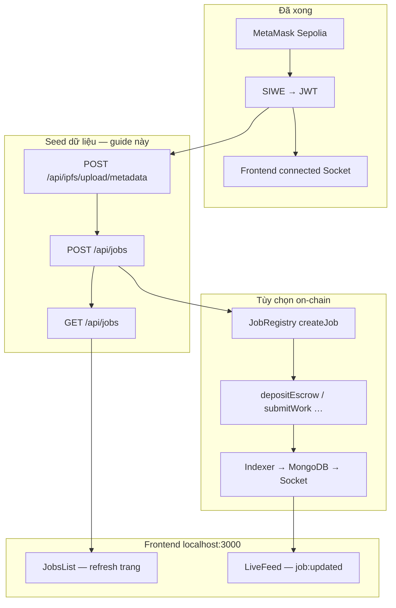

# Hướng dẫn tạo dữ liệu demo & trình diễn Fapex end-to-end (tiếng Việt)

Tài liệu này hướng dẫn **tạo job thật trên production Railway**, xem kết quả trên **frontend local** (`localhost:3000`), và chuẩn bị **kịch bản thuyết trình ~10 phút** cho buổi demo học thuật.

**Bối cảnh mẫu (trạng thái hiện tại):**

| Thành phần | Giá trị |
|------------|---------|
| Frontend | `http://localhost:3000` — đã đăng nhập SIWE, Socket **connected**, chưa có job |
| Backend production | `https://fapex-backend-production.up.railway.app` |
| Ví demo (screenshot) | `0xa7ac8154fa3019f5c95ba3720240c782c0c3cd70` |
| File test API | `backend/api-tests.http` — section **Production — Railway** |

> **Giả định:** Bạn **đã hoàn tất auth** (có JWT trong frontend hoặc sẵn sàng lấy lại qua SIWE). Guide tập trung vào bước **seed job** và **demo UI**.

---

## 1. Tổng quan luồng end-to-end



| Bước | API / hành động | Bắt buộc? | Kết quả |
|------|-----------------|-----------|---------|
| 0 | JWT (SIWE) | Có | `Authorization: Bearer …` |
| 1 | `POST /api/ipfs/upload/metadata` | **Tùy chọn** (minh họa IPFS) | `metadataCID` |
| 2 | `POST /api/jobs` | **Có** (seed chính) | Job trong MongoDB + gọi `createJob` on-chain |
| 3 | `GET /api/jobs` | Kiểm tra | Danh sách public |
| 4 | Refresh frontend | Có (hiện tại) | Thẻ job trên UI |
| 5 | On-chain + indexer | Tùy chọn | Event `job:updated` trên LiveFeed |

**Lưu ý kiến trúc:**

- `POST /api/jobs` **tự upload metadata lên Pinata** — không cần gọi IPFS trước, trừ khi bạn muốn demo bước IPFS riêng.
- `POST /api/jobs` **không emit Socket** trực tiếp. LiveFeed nhận `job:updated` khi **event indexer** hoặc **realtime listener** đồng bộ thay đổi từ chain.
- Frontend `useJobs` chỉ fetch **một lần khi mount** — sau khi seed, **F5 / refresh** để thấy job mới.

---

## 2. Điều kiện tiên quyết

### 2.1. Phần mềm & tài khoản

| Hạng mục | Chi tiết |
|----------|----------|
| **MetaMask** | Mạng **Sepolia** (`chainId: 11155111`), có ETH testnet |
| **Ví demo** | Địa chỉ đã đăng nhập frontend (vd. `0xa7ac8154fa3019f5c95ba3720240c782c0c3cd70`) |
| **JWT** | Token từ `POST /api/auth/verify` — cùng ví với `@walletAddressProd` |
| **REST Client** hoặc **Postman Desktop** | Gọi API production |
| **Frontend** | `cd frontend && npm run dev` → `http://localhost:3000` |
| **Pinata** | `PINATA_JWT` đã cấu hình trên Railway (team deploy) |
| **RPC Sepolia** | `RPC_URL` trên Railway — cho `createJob` on-chain |

### 2.2. Biến môi trường frontend (`frontend/.env`)

```env
VITE_API_URL=https://fapex-backend-production.up.railway.app
VITE_WALLETCONNECT_PROJECT_ID=<walletconnect_project_id>
```

Railway cần có `ALLOWED_ORIGINS` chứa `http://localhost:3000` (và cổng dev nếu khác) để CORS REST + Socket.io hoạt động từ máy local.

### 2.3. Kiểm tra nhanh trước khi seed

```powershell
curl.exe https://fapex-backend-production.up.railway.app/health
```

Mong đợi: `status: ok`, `mongodb: connected`, `websocket.enabled: true`.

Trên frontend: header hiển thị ví đã connect, panel **Live updates** → `Socket connected`.

---

## 3. Trường bắt buộc — `POST /api/jobs`

Validation thực tế trong `backend/src/routes/jobRoutes.js`:

| Trường | Kiểu | Ràng buộc | Ghi chú |
|--------|------|-----------|---------|
| `title` | string | Không rỗng, **5–100** ký tự | |
| `description` | string | Không rỗng, **≥ 20** ký tự | |
| `category` | string | Không rỗng | Không giới hạn enum (vd. `development`, `design`) |
| `contractValue` | **integer** | **≥ 1** | Đơn vị USDC (số nguyên, backend/contract) |
| `duration` | **integer** (giây) | **≥ 3600** (1 giờ) | Ví dụ `604800` = 7 ngày |
| `skills` | array of string | **Tùy chọn** | |
| `deliverables` | string | Không rỗng | |
| `acceptanceCriteria` | string | Không rỗng | |

**Header:** `Authorization: Bearer <JWT>`

**Không gửi trong body:** `clientAddress` — backend lấy từ JWT (`req.user.walletAddress`).

**Điều kiện nghiệp vụ:**

- User phải tồn tại trong MongoDB (tạo qua nonce/verify).
- `reputation.tier` không được là `Restricted` → nếu 403, dùng ví khác hoặc nhờ team sửa tier.

**Response 201 thành công (mẫu):**

```json
{
  "success": true,
  "message": "Job created successfully",
  "jobId": 42,
  "onchainJobId": 42,
  "metadataCID": "Qm...",
  "job": {
    "_id": "...",
    "title": "...",
    "status": "OPEN",
    "contractValue": 100,
    "onchainJobId": 42,
    "metadataCID": "Qm...",
    "clientAddress": "0xa7ac8154fa3019f5c95ba3720240c782c0c3cd70"
  }
}
```

> Nếu gọi contract thất bại (RPC/key), backend **fallback** `onchainJobId = Date.now()` — job vẫn lưu MongoDB; ghi chú khi demo nếu số on-chain trông như timestamp.

**Lỗi validation 400 (mẫu):**

```json
{
  "success": false,
  "errors": [
    { "field": "title", "message": "Invalid value" }
  ]
}
```

---

## 4. Cách 1 — REST Client (`api-tests.http`)

### 4.1. Cấu hình biến Production

Mở `backend/api-tests.http`, cuộn tới section **Production — Railway**:

```http
@baseUrlProd = https://fapex-backend-production.up.railway.app
@walletAddressProd = 0xa7ac8154fa3019f5c95ba3720240c782c0c3cd70
@authTokenProd = eyJhbGciOiJIUzI1NiIs...
```

| Biến | Khi nào điền |
|------|----------------|
| `@walletAddressProd` | Trước bước 02-prod (nonce) — **EIP-55 checksum** |
| `@authTokenProd` | Sau bước 03b-prod / 04-prod — copy field `token` |
| `@siweMessageProd`, `@siweSignatureProd` | Chỉ nếu dùng 03-prod (không khuyến nghị) |

### 4.2. Lấy JWT (nếu chưa có hoặc hết hạn)

1. **`01-prod`** — `GET /health`
2. **`02-prod`** — `POST /api/auth/nonce` với `walletAddressProd`
3. Mở [siwe-sign.html production](https://fapex-backend-production.up.railway.app/siwe-sign.html) → Connect MetaMask → Lấy nonce → Ký → **Copy JSON cho Postman**
4. `cd backend` → `cp verify-body.json.example verify-body-prod.json` → dán JSON → **`03b-prod`**
5. Copy `token` → `@authTokenProd`
6. **`04-prod`** — `GET /api/auth/me` xác nhận JWT

Chi tiết SIWE: [production-api-test-vi.md](./production-api-test-vi.md).

### 4.3. Bước IPFS (tùy chọn — demo metadata)

Gửi **`05-prod`** — `POST /api/ipfs/upload/metadata`:

```json
{
  "title": "Smart Contract Audit",
  "description": "Audit Solidity escrow contracts on Sepolia testnet.",
  "category": "development",
  "skills": ["Solidity", "Security"],
  "deliverables": "PDF audit report with findings and remediation plan.",
  "acceptanceCriteria": "All critical and high issues documented with reproducible PoCs.",
  "clientAddress": "{{walletAddressProd}}",
  "createdAt": "2026-06-24T00:00:00.000Z"
}
```

Response: `metadataCID` / `cid`. Bước này **độc lập** với `POST /api/jobs` — job endpoint sẽ upload metadata **lần nữa** khi tạo job.

### 4.4. Tạo job — **`06-prod`** (bước chính)

Body mặc định trong file (đã đúng validation):

```json
{
  "title": "Smart Contract Audit",
  "description": "Audit Solidity escrow contracts on Sepolia testnet for security vulnerabilities.",
  "category": "development",
  "contractValue": 100,
  "duration": 604800,
  "skills": ["Solidity", "Security"],
  "deliverables": "PDF audit report with findings and remediation plan.",
  "acceptanceCriteria": "All critical and high issues documented with reproducible PoCs."
}
```

**Gửi nhiều job demo** — đổi `title` / `category` / `contractValue`, gửi lại `06-prod` (giữ nguyên header Bearer):

**Job 2 — UI/UX:**

```json
{
  "title": "Landing Page Redesign",
  "description": "Redesign marketing landing page for Web3 freelance platform with responsive layout.",
  "category": "design",
  "contractValue": 250,
  "duration": 1209600,
  "skills": ["Figma", "UI/UX"],
  "deliverables": "Figma file plus exported assets and style guide.",
  "acceptanceCriteria": "Mobile-first design approved by client with two revision rounds."
}
```

**Job 3 — Nội dung:**

```json
{
  "title": "Technical Blog Series",
  "description": "Write three blog posts explaining escrow smart contracts and dispute resolution for developers.",
  "category": "writing",
  "contractValue": 75,
  "duration": 432000,
  "skills": ["Technical Writing", "Solidity"],
  "deliverables": "Three Markdown articles with diagrams ready for publication.",
  "acceptanceCriteria": "Each post reviewed for accuracy against Sepolia contract addresses."
}
```

### 4.5. Xác nhận — **`07-prod`**

`GET /api/jobs?page=1&limit=20` — không cần auth.

Kiểm tra `jobs[]` có các bản ghi vừa tạo, `status: "OPEN"`, `isActive: true`.

**Lọc theo client:**

```
GET {{baseUrlProd}}/api/jobs/client/0xa7ac8154fa3019f5c95ba3720240c782c0c3cd70
```

---

## 5. Cách 2 — Postman Desktop

### 5.1. Import

1. [Postman Desktop](https://www.postman.com/downloads/) — **không** dùng extension VS Code/Cursor
2. Import:
   - `backend/postman/Fapex.postman_collection.json`
   - `backend/postman/Fapex-Local.postman_environment.json`

### 5.2. Environment Production

Duplicate environment **Fapex — Local** → đặt tên **Fapex — Production**:

| Biến | Giá trị production |
|------|-------------------|
| `baseUrl` | `https://fapex-backend-production.up.railway.app` |
| `walletAddress` | `0xa7ac8154fa3019f5c95ba3720240c782c0c3cd70` |
| `authToken` | JWT sau verify |
| `siweDomain` | `fapex-backend-production.up.railway.app` |
| `chainId` | `11155111` |

Chọn environment **Fapex — Production** ở góc trên phải.

### 5.3. Thứ tự folder

| Folder | Request | Ghi chú |
|--------|---------|---------|
| 01 — Health | GET /health | Smoke test |
| 02 — Auth | POST nonce → verify → GET me | SIWE qua [siwe-sign.html](https://fapex-backend-production.up.railway.app/siwe-sign.html) |
| 03 — IPFS | POST /api/ipfs/upload/metadata | Tùy chọn |
| 04 — Jobs | **POST /api/jobs** | Body giống mục 4.4 |
| 04 — Jobs | GET /api/jobs | Xác nhận danh sách |

Collection có pre-request script cho verify — dán message SIWE nhiều dòng vào `siweMessage` an toàn.

Chi tiết: [postman-walkthrough-vi.md](./postman-walkthrough-vi.md) (phần Bước 8–10).

---

## 6. Sau khi seed — Frontend (`localhost:3000`)

### 6.1. Panel Jobs

Component `JobsList` gọi `GET /api/jobs` qua `VITE_API_URL`.

**Sau `POST /api/jobs` thành công:**

1. **Refresh trang** (`F5` hoặc `Ctrl+R`) — hook `useJobs` chưa tự refetch.
2. Thay vì "No jobs yet.", bạn sẽ thấy danh sách thẻ job:
   - **Tiêu đề** + badge **OPEN**
   - Mô tả rút gọn
   - Category, **contractValue USDC**, **On-chain #&lt;id&gt;** (nếu có)
   - Client: `0xa7ac…cd70` (rút gọn)

### 6.2. Panel Live updates

- Trạng thái: **Socket connected** (đã có JWT trong `AuthContext`).
- Mặc định: *"Listening for job:updated events…"* — **bình thường** ngay sau seed chỉ qua REST.
- `POST /api/jobs` **không** push event tới socket.

### 6.3. Khi nào LiveFeed có dữ liệu?

| Cách | Mô tả |
|------|--------|
| **A. Indexer bật** | Railway `ENABLE_EVENT_INDEXER=true` — sau tx on-chain (deposit, submit work, …) indexer cập nhật MongoDB → `notifyJobChange` → `job:updated` |
| **B. Realtime WSS** | `SEPOLIA_WSS_URL` + listener — event escrow gần realtime |
| **C. Demo không indexer** | Giải thích cho giảng viên: REST seed đủ cho danh sách job; realtime là lớp bổ sung khi có hoạt động chain |

Frontend hiện chỉ lắng nghe **`job:updated`** (không `job:created`). Payload mẫu trên LiveFeed:

```json
{
  "eventType": "escrow:deposited",
  "onchainJobId": 42,
  "status": "ASSIGNED",
  "clientAddress": "0xa7ac...",
  "freelancerAddress": "0x...",
  "timestamp": "2026-06-24T12:00:00.000Z"
}
```

### 6.4. Subscribe theo job (nâng cao)

Trong DevTools console (đã connect socket qua app):

```javascript
// Cần socket instance — hoặc dùng Postman/socket.io-client test client
socket.emit('subscribe:job', 42); // onchainJobId từ response POST /api/jobs
```

Khi indexer phát event cho `job:42`, client đã subscribe sẽ nhận `job:updated`.

---

## 7. Bước on-chain tùy chọn (sau seed)

Sau khi có `onchainJobId` từ `POST /api/jobs`, có thể demo thêm trên Sepolia (MetaMask + Etherscan):

| Bước | Contract | Hành động |
|------|----------|-----------|
| 1 | MockUSDC | `mint` USDC testnet |
| 2 | JobRegistry | Freelancer `submitProposal` |
| 3 | EscrowVault | Client `depositEscrow` |
| 4 | EscrowVault | Freelancer `startWork` → `submitWork` |
| 5 | EscrowVault | Client `approveAndRelease` |

Địa chỉ contract Sepolia: [contract-interaction.md](./contract-interaction.md).

Khi indexer chạy, các bước 3–5 sẽ kích hoạt **`job:updated`** trên frontend mà không cần refresh JobsList (LiveFeed only — JobsList vẫn cần F5 để cập nhật status).

---

## 8. Kịch bản thuyết trình ~10 phút

Dùng cho buổi báo cáo Contributor 2 / demo đồ án.

| Phút | Nội dung | Màn hình / thao tác |
|------|----------|---------------------|
| **0:00–1:00** | Giới thiệu Fapex: escrow USDC, JobRegistry, backend Railway | Slide kiến trúc (MongoDB + Pinata + Sepolia) |
| **1:00–2:00** | **Health** production | `curl` hoặc `01-prod` → JSON `mongodb: connected`, websocket enabled |
| **2:00–4:00** | **SIWE** — đăng nhập không mật khẩu | Mở `siwe-sign.html` → MetaMask Sepolia → ký → JWT |
| **4:00–5:00** | **Frontend** đã login | `localhost:3000` — ví `0xa7ac…cd70`, Socket connected, "No jobs yet" |
| **5:00–7:00** | **Seed job** qua API | REST Client `06-prod` (hoặc Postman) — show response `metadataCID`, `onchainJobId` |
| **7:00–8:00** | **GET jobs** + refresh UI | `07-prod` → F5 frontend → 1–3 thẻ job OPEN |
| **8:00–9:00** | **IPFS** (30 giây) | `05-prod` hoặc giải thích Pinata lưu metadata off-chain, CID on-chain |
| **9:00–10:00** | **Realtime / hạn chế** | LiveFeed: nếu indexer tắt → nói rõ; nếu có Etherscan tx deposit → chờ `job:updated`. Q&A |

**Câu thoại gợi ý (tiếng Việt):**

> "Frontend chỉ là lớp hiển thị; source of truth là smart contract Sepolia. Backend mirror job vào MongoDB và phát thông báo qua Socket khi indexer đồng bộ event chain. Hôm nay em seed job qua REST để lấp danh sách demo; bước escrow em có thể mở Etherscan minh chứng transaction."

**Slide nên có:** screenshot health, SIWE page v4, Postman/REST 201, frontend Jobs list, (tùy chọn) Etherscan `createJob`.

---

## 9. Xử lý sự cố (Troubleshooting)

### Auth / JWT

| Triệu chứng | Cách xử lý |
|-------------|------------|
| 401 trên `06-prod` | Điền `@authTokenProd`; verify lại nếu token hết hạn |
| 403 Restricted users cannot create jobs | Đổi ví hoặc cập nhật tier user trong DB |
| SIWE failed trên production | Nonce mới trên **cùng** URL Railway; `domain` = `fapex-backend-production.up.railway.app` |

### Validation POST /api/jobs

| Triệu chứng | Cách xử lý |
|-------------|------------|
| 400 `title` | Ít nhất 5 ký tự |
| 400 `description` | Ít nhất 20 ký tự |
| 400 `duration` | Tối thiểu `3600` (số nguyên, đơn vị giây) |
| 400 `contractValue` | Số nguyên ≥ 1 — không gửi chuỗi `"100"` nếu validator từ chối |

### Pinata / RPC

| Triệu chứng | Cách xử lý |
|-------------|------------|
| 500 IPFS upload failed | Railway thiếu/sai `PINATA_JWT` |
| 500 Create job / contract error | Kiểm tra `RPC_URL`, `INDEXER_PRIVATE_KEY` / wallet backend; job có thể vẫn lưu với `onchainJobId` fallback |
| Infura rate limit trong log | `ENABLE_EVENT_INDEXER=false` — API seed vẫn OK; tắt spam log khi demo |

### Frontend

| Triệu chứng | Cách xử lý |
|-------------|------------|
| GET jobs OK nhưng UI trống | **Refresh trang**; kiểm tra `VITE_API_URL` trỏ production |
| Socket disconnected | Đăng nhập lại SIWE; `ALLOWED_ORIGINS` có `http://localhost:3000` |
| LiveFeed không có event sau seed REST | **Đúng thiết kế** — cần indexer + thay đổi on-chain |
| CORS error | Thêm origin frontend vào Railway `ALLOWED_ORIGINS` → redeploy |

### MongoDB

| Triệu chứng | Cách xử lý |
|-------------|------------|
| `mongodb: disconnected` | Sửa `MONGODB_URI` Atlas trên Railway |
| Job tạo 201 nhưng GET trống | Kiểm tra `isActive: true`; thử `GET /api/jobs/client/<address>` |

---

## 10. Checklist hoàn tất demo

- [ ] `GET /health` production → MongoDB connected
- [ ] JWT hợp lệ (`04-prod` / frontend logged in)
- [ ] `POST /api/jobs` → 201, có `metadataCID` và `job`
- [ ] `GET /api/jobs` → thấy ≥ 1 job
- [ ] Frontend refresh → thẻ job hiển thị
- [ ] Socket connected trên LiveFeed
- [ ] (Tùy chọn) `05-prod` IPFS → `metadataCID`
- [ ] (Tùy chọn) Etherscan tx + `job:updated` khi indexer bật

---

## Tài liệu liên quan

| Tài liệu | Nội dung |
|----------|----------|
| [production-api-test-vi.md](./production-api-test-vi.md) | Test API production từ health → JWT |
| [postman-walkthrough-vi.md](./postman-walkthrough-vi.md) | Luồng Postman/REST chi tiết |
| [contract-interaction.md](./contract-interaction.md) | Tương tác escrow / dispute on-chain |
| [deploy-backend.md](./deploy-backend.md) | Railway env, WebSocket, indexer |
| [contributor2-progress.md](../report/contributor2-progress.md) | Outline demo báo cáo |
| `backend/api-tests.http` | Biến `@baseUrlProd`, `@authTokenProd`, request `05-prod`–`07-prod` |
