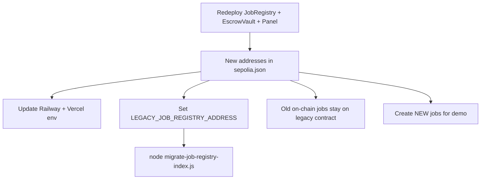

# FAPEX — Bản đồ On-chain / Off-chain

> **English summary:** Data authority map — what lives on Sepolia contracts vs MongoDB vs IPFS, including post-redeploy JobRegistry scoping.

**Cập nhật:** 2026-06-28

**JobRegistry hiện tại:** `0x302629f82d51b0972ffc3A99cbE355F4acEf908d`  
**Legacy JobRegistry:** `0xE5425cFE21BAe73d54138Bb290B671bF4c55FBC9`

---

## Mô hình ví

| Vai trò | Ví | Hành động on-chain |
|--------|-----|-------------------|
| **Client** | Cùng ví SIWE + MetaMask khi tx | `createJob`, `depositEscrow`, `approveAndRelease`, `raiseDispute` |
| **Freelancer** | MetaMask freelancer | `startWork`, `submitWork`, evidence |
| **Arbitrator** | Ví seed pool | `commitVote`, `revealVote` |
| **Indexer** | `INDEXER_PRIVATE_KEY` | Đọc events → MongoDB; optional relay `createJob` |

`clientAddress` (MongoDB) và `onchainClientAddress` (JobRegistry) **phải trùng** sau `createJob`.

Frontend: `WalletMismatchBanner` khi MetaMask ≠ party on-chain.

---

## Bảng mapping dữ liệu

| Trường / Khái niệm | Chỉ on-chain | Chỉ off-chain | Kết hợp (sync) |
|---------------------|--------------|---------------|----------------|
| `onchainJobId` | `JobRegistry.jobCounter` | — | Khóa compound với `jobRegistryAddress` |
| `jobRegistryAddress` | Địa chỉ deploy | Lưu lúc tạo job | Phân biệt job sau redeploy |
| `clientAddress` | — | Ví SIWE | Trùng `onchainClientAddress` |
| `onchainClientAddress` | `Job.client` | Mirror sau API | Preflight `depositEscrow` |
| `freelancerAddress` | `Job.freelancer` sau deposit | Bid accepted (tạm) | `EscrowDeposited` ghi đè |
| `status` | `JobStatus` enum 0–7 | `Job.status` string | Indexer reconcile |
| `metadataCID` | `jobMetadataCID` | IPFS upload trước | FE → chain → API |
| `deliverableCID` | on-chain field | — | `WorkSubmitted` |
| `title`, `description`, `skills` | — | MongoDB + IPFS JSON | — |
| **Bids** | `submitProposal` optional | `Bid` collection | Bid API = off-chain |
| **User profile** | `ReputationStore` | `User` model | Tier map |
| **Dispute** | votes, evidence hash | `Dispute` model | Indexer sync |
| **Escrow balance** | `EscrowVault` + USDC | — | UI `balanceOf` |
| **Platform fee 3%** | `depositEscrow` | Display only | — |

---

## Trạng thái job — đồng bộ

| Mã | On-chain | Backend `Job.status` | Ghi chú |
|----|----------|----------------------|---------|
| 0 | OPEN | OPEN | Sau accept bid DB có thể ASSIGNED trước deposit |
| 1 | ASSIGNED | ASSIGNED | Sau `depositEscrow` |
| 2 | IN_PROGRESS | IN_PROGRESS | `startWork` |
| 3 | SUBMITTED | SUBMITTED | `submitWork` |
| 4 | DISPUTED | DISPUTED | `raiseDispute` |
| 5 | COMPLETED | COMPLETED | release / dispute win FL |
| 6 | REFUNDED | REFUNDED | cancel / client win dispute |
| 7 | CANCELLED | CANCELLED | `cancelOpenJob` |

**FE:** `useOnChainJob` ưu tiên chain.  
**BE:** `isChainStatusAhead` kéo DB lên.

---

## Dispute timings (demo — redeploy 2026-06-27)

| Phase | Demo on-chain | Production |
|-------|---------------|------------|
| Evidence initial | 0 → **5 min** | 72 h |
| Evidence rebuttal | 5 → **10 min** | 120 h |
| Commit vote | **10 → 13 min** | 120 → 144 h |
| Reveal vote | **13 → 16 min** | 144 → 168 h |
| Appeal window | **30 min** | 72 h |

**Tổng evidence window demo:** 0 → 10 phút (initial + rebuttal).

FE: `frontend/src/lib/contracts/disputeTimings.ts`

---

## Redeploy implications

| Contract | Sau redeploy |
|----------|--------------|
| MockUSDC | Thường **giữ** địa chỉ cũ (`USDC_ADDRESS` env) |
| JobRegistry | **Địa chỉ mới** — job cũ không migrate |
| EscrowVault, ArbitratorPanel | **Mới** — link lại authorized |
| MongoDB jobs | Scope bởi `jobRegistryAddress` |

---

## UI tranh chấp

| Panel | Ai thấy | Nội dung |
|-------|---------|----------|
| `DisputeEvidencePanel` | Mọi người (DISPUTED) | Evidence on-chain + off-chain hydrate |
| `ArbitratorDisputePanel` | Arbitrator được chọn | Commit/reveal, vote tally |
| `DisputeResultPanel` | Client / freelancer | Kết quả, appeal countdown |

---

## Địa chỉ Sepolia (canonical)

| Contract | Address |
|----------|---------|
| MockUSDC | `0x2293193Eaa5CE5253d5e081046a06dB077f26f8e` |
| JobRegistry | `0x302629f82d51b0972ffc3A99cbE355F4acEf908d` |
| EscrowVault | `0x5f8C4c552F49103cA84dF455571155C8268C2aF5` |
| ArbitratorPanel | `0x490Afc952af85aB0dEb375Bd36A65db5E1F47418` |
| PlatformTreasury | `0x666aF0Ec040377026E0D40870Bce7c165f741530` |
| ReputationStore | `0x5e457db6a8A44C143180043c5Bb7223C7222898E` |
| Legacy JobRegistry | `0xE5425cFE21BAe73d54138Bb290B671bF4c55FBC9` |

---

## File tham chiếu

| Layer | Path |
|-------|------|
| Contracts | `contracts/FreelanceSystem.sol`, `contracts/config/DisputeTimings.demo.sol` |
| Backend | `backend/src/services/blockchain/eventIndexer.js`, `backend/src/utils/jobScope.js` |
| Frontend | `frontend/src/hooks/useCreateJob.ts`, `frontend/src/hooks/useEscrowDeposit.ts` |
| Migration | `backend/scripts/migrate-job-registry-index.js` |
