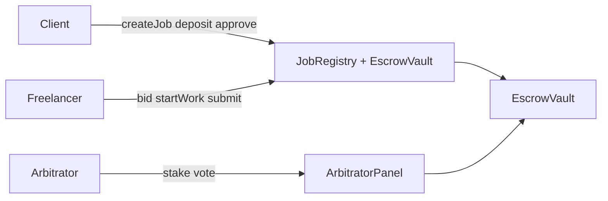

# FAPEX — Tổng quan dự án

> **English summary:** FAPEX is a Web3 freelance escrow dApp on Ethereum Sepolia. Clients fund jobs in MockUSDC; freelancers deliver via IPFS; disputes are resolved by a staked arbitrator panel with commit–reveal voting. A Node.js backend caches chain events in MongoDB and proxies IPFS uploads; the React frontend uses wagmi + SIWE for wallet-native UX.

**Cập nhật:** 2026-06-30 · **Mạng:** Sepolia (chainId `11155111`)

---

## FAPEX là gì?

**FAPEX** (Freelance Apex) là nền tảng freelance phi tập trung kết hợp:

| Thành phần | Vai trò |
|------------|---------|
| **Smart contracts** | Escrow USDC, lifecycle job, tranh chấp commit–reveal, reputation soulbound |
| **Backend (Railway)** | SIWE → JWT, API jobs/bids/disputes, indexer sự kiện on-chain, Pinata IPFS, Socket.io |
| **Frontend (Vercel)** | UI tiếng Anh, light/dark theme, RainbowKit + MetaMask, dashboards theo role |

**Triết lý thiết kế:** *On-chain = nguồn sự thật cho tiền và trạng thái job; off-chain = metadata, bids, UX nhanh.*

---

## Monorepo

```
Blockchain/                    ← Hardhat root, deployments/, scripts/
├── contracts/                 ← Solidity (submodule blockchain-contracts)
├── backend/                   ← Node API (submodule blockchain-backend)
├── frontend/                  ← Vite + React (submodule blockchain-frontend)
└── docs/                      ← Tài liệu (submodule Blockchain-docs)
```

| Submodule | GitHub org | Mô tả |
|-----------|------------|--------|
| Root | `thanhltkk24414-lang/Blockchain` | Deploy scripts, tests, `deployments/sepolia.json` |
| contracts | `blockchain-contracts` | `FreelanceSystem.sol`, MockUSDC, DisputeTimings |
| backend | `blockchain-backend` | Express, MongoDB, indexer, SIWE |
| frontend | `blockchain-frontend` | wagmi UI canonical |
| docs | `Blockchain-docs` | Báo cáo, manual, demo script |

---

## Production (tháng 6/2026)

| Dịch vụ | URL / nền tảng |
|---------|----------------|
| **Backend API** | https://fapex-backend-production.up.railway.app |
| **Health** | `GET /health` |
| **Config** | `GET /api/config` |
| **SIWE demo** | `/siwe-sign.html` |
| **WebSocket** | `/socket.io` (JWT) |
| **Frontend** | Vercel preview + production (`*.vercel.app`) |
| **CORS** | `ALLOWED_ORIGINS` gồm `https://*.vercel.app` |

---

## Hợp đồng Sepolia (deploy 2026-06-27)

Nguồn canonical: `deployments/sepolia.json` · `disputeTimings: "demo"`

| Contract | Địa chỉ |
|----------|---------|
| MockUSDC | `0x2293193Eaa5CE5253d5e081046a06dB077f26f8e` |
| JobRegistry | `0x302629f82d51b0972ffc3A99cbE355F4acEf908d` |
| EscrowVault | `0x5f8C4c552F49103cA84dF455571155C8268C2aF5` |
| ArbitratorPanel | `0x490Afc952af85aB0dEb375Bd36A65db5E1F47418` |
| PlatformTreasury | `0x666aF0Ec040377026E0D40870Bce7c165f741530` |
| ReputationStore | `0x5e457db6a8A44C143180043c5Bb7223C7222898E` |
| **Legacy JobRegistry** | `0xE5425cFE21BAe73d54138Bb290B671bF4c55FBC9` (job cũ trước redeploy) |

---

## Ba vai trò người dùng



1. **Client** — đăng job, chấp nhận bid, nạp escrow, phê duyệt hoặc khiếu nại
2. **Freelancer** — bid, làm việc, nộp deliverable (CID IPFS on-chain)
3. **Arbitrator** — stake ≥50 MockUSDC, join pool, vote tranh chấp được sortition chọn

---

## Luồng chính (một câu)

```
SIWE → đăng ký role → createJob → bid → accept → depositEscrow → startWork → submitWork
  → approveAndRelease  HOẶC  raiseDispute → evidence → commit/reveal → finalize → execute
```

Chi tiết: [workflow-e2e-vi.md](workflow-e2e-vi.md)

---

## Tài liệu liên quan

| Tài liệu | Nội dung |
|----------|----------|
| [tech-stack-vi.md](tech-stack-vi.md) | Công nghệ và mục đích từng thành phần |
| [system-design-vi.md](system-design-vi.md) | Kiến trúc, diagram, indexer |
| [manual-vi.md](manual-vi.md) | Hướng dẫn user + dev local |
| [demo-script-vi.md](demo-script-vi.md) | Kịch bản thuyết trình ~15 phút |
| [demo-qa-defense-vi.md](demo-qa-defense-vi.md) | FAQ phòng vấn hội đồng |
| [platform-mechanisms-vi.md](platform-mechanisms-vi.md) | SPLIT, appeal, no-deliverable, reputation |
| [admin-roles-vi.md](admin-roles-vi.md) | Governance roles chi tiết |
| [project-report-vi.md](project-report-vi.md) | Outline báo cáo đồ án |
