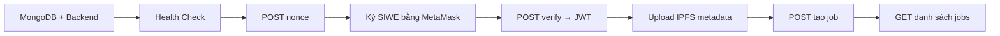

# Hướng dẫn chi tiết test API ShareVolt bằng Postman (tiếng Việt)

Tài liệu này hướng dẫn **từng bước** luồng kiểm thử backend ShareVolt: khởi động môi trường → import Postman → đăng nhập ví (SIWE) → upload IPFS → tạo job → xem danh sách job.

> **Mục tiêu:** Sau khi làm theo guide, bạn có thể gọi API thành công mà hiểu **tại sao** mỗi bước cần thiết.

---

## Tổng quan luồng



| Bước | API | Cần gì |
|------|-----|--------|
| 0 | Chuẩn bị | Docker MongoDB, backend chạy, Postman import |
| 1 | Import collection | File JSON trong `backend/postman/` |
| 2 | Cấu hình biến | `baseUrl`, `walletAddress` |
| 3 | `GET /health` | Không cần DB (nhưng nên có MongoDB) |
| 4 | `POST /api/auth/nonce` | MongoDB |
| 5 | Ký SIWE (thủ công) | MetaMask + Sepolia |
| 6 | `POST /api/auth/verify` | Message + chữ ký từ bước 5 |
| 7 | Copy `authToken` | JWT từ response verify |
| 8 | `POST /api/ipfs/upload/metadata` | Bearer token + Pinata |
| 9 | `POST /api/jobs` | Token + MongoDB + Pinata + RPC Sepolia |
| 10 | `GET /api/jobs` | MongoDB |

---

## Phần A — Điều kiện tiên quyết

### A.1. Phần mềm cần cài

| Phần mềm | Mục đích |
|----------|----------|
| [Node.js](https://nodejs.org/) (LTS) | Chạy backend |
| [Docker Desktop](https://www.docker.com/products/docker-desktop/) | Chạy MongoDB local |
| [Postman](https://www.postman.com/downloads/) | Gọi API |
| [MetaMask](https://metamask.io/) | Ví Ethereum, ký SIWE |
| Tài khoản Sepolia | Ví có ETH testnet (faucet Sepolia) |

### A.2. Biến môi trường backend (`backend/.env`)

Sao chép file mẫu và điền giá trị:

```bash
cd backend
cp .env.example .env
```

Các biến **bắt buộc** cho luồng Postman đầy đủ:

```env
PORT=5000
MONGODB_URI=mongodb://127.0.0.1:27017/freelance-platform
JWT_SECRET=chuoi_bi_mat_dai_ngau_nhien
PINATA_JWT=eyJ...   # lấy từ https://app.pinata.cloud
RPC_URL=https://sepolia.infura.io/v3/YOUR_PROJECT_ID

SIWE_DOMAIN=localhost
APP_URL=http://localhost:3000
CHAIN_ID=11155111

# Khuyến nghị khi test Postman — tắt indexer để tránh lỗi Infura rate limit
ENABLE_EVENT_INDEXER=false
```

> **Lưu ý Windows:** Luôn dùng `127.0.0.1` thay vì `localhost` trong `MONGODB_URI` và `baseUrl` Postman — tránh lỗi IPv6 `ECONNREFUSED ::1:27017`.

### A.3. Khởi động MongoDB (Docker)

Mở terminal tại thư mục `backend`:

```bash
npm run docker:mongo
```

Script sẽ:
- Tạo container MongoDB **chạy nền** (detached) tên `mongo`
- In connection string và **thoát ngay** — terminal không bị treo

Kết quả mong đợi:

```
✅ Created and started MongoDB container "mongo" (detached).

Connection string for backend/.env:
  MONGODB_URI=mongodb://127.0.0.1:27017/freelance-platform
```

Nếu container đã tồn tại, script chỉ **start** lại và báo trạng thái.

**Lệnh hữu ích:**

```bash
docker ps              # xem container đang chạy
docker stop mongo      # dừng MongoDB
docker rm -f mongo     # xóa container (chạy lại docker:mongo để tạo mới)
```

### A.4. Khởi động backend

```bash
cd backend
npm install
npm start
# hoặc phát triển: npm run dev
```

Khi thành công, log hiển thị:

```
Server running on port 5000
```

Nếu `ENABLE_EVENT_INDEXER=false`, bạn sẽ thấy:

```
Event indexer disabled (ENABLE_EVENT_INDEXER=false)
```

Điều này **bình thường** khi test Postman — indexer không cần thiết cho auth/jobs.

---

## Phần B — Import Postman

### Bước 1: Import Collection và Environment

1. Mở **Postman**
2. Nhấn **Import** (góc trên trái)
3. Kéo thả hoặc chọn **hai file** trong repo:

   | File | Vai trò |
   |------|---------|
   | `backend/postman/Freelance-Platform.postman_collection.json` | Danh sách request API |
   | `backend/postman/Freelance-Platform.postman_environment.json` | Biến môi trường (URL, token, ví…) |

4. Sau import, sidebar trái có collection **Freelance Platform API** với các folder:
   - `01 — Health`
   - `02 — Auth (SIWE + JWT)`
   - `03 — IPFS`
   - `04 — Jobs`
   - `05 — Arbitrator`

### Bước 2: Chọn Environment và cấu hình biến

1. Góc trên phải Postman, chọn environment **Freelance Platform — Local**
2. Nhấn biểu tượng **mắt** → **Edit** để sửa biến:

| Biến | Giá trị | Giải thích |
|------|---------|------------|
| `baseUrl` | `http://127.0.0.1:5000` | URL backend (khớp `PORT` trong `.env`) |
| `walletAddress` | `0xABC...` | Địa chỉ ví MetaMask Sepolia của bạn |
| `authToken` | *(để trống ban đầu)* | JWT sau bước verify |
| `siweMessage` | *(để trống)* | Chuỗi message SIWE đã ký |
| `siweSignature` | *(để trống)* | Chữ ký hex từ MetaMask |

3. **Save** environment

---

## Phần C — Chạy từng request

### Bước 3: Health Check

1. Mở folder **01 — Health**
2. Chọn **GET /health**
3. Nhấn **Send**

**Response mong đợi (200):**

```json
{
  "status": "ok",
  "mongodb": "connected",
  ...
}
```

| Trường `mongodb` | Ý nghĩa |
|------------------|---------|
| `"connected"` | MongoDB OK — tiếp tục test nonce/jobs |
| `"disconnected"` | Chạy `npm run docker:mongo` và kiểm tra `MONGODB_URI` |

> Health check **không cần** MongoDB để trả 200, nhưng các bước sau **cần** MongoDB connected.

---

### Bước 4: Auth — Lấy nonce

1. Folder **02 — Auth** → **POST /api/auth/nonce**
2. Body đã có sẵn: `{ "walletAddress": "{{walletAddress}}" }`
3. Nhấn **Send**

**Response mong đợi (200):**

```json
{
  "success": true,
  "nonce": "a1b2c3d4e5f6...",
  "walletAddress": "0x...",
  "domain": "localhost",
  "chainId": 11155111
}
```

Postman **tự lưu** `nonce`, `chainId`, `siweDomain` vào environment (script Tests).

**Nonce chỉ dùng một lần** — hết hạn sau khi verify thành công hoặc khi gọi nonce mới.

---

### Bước 5: Ký SIWE bằng MetaMask (bước thủ công — quan trọng)

Postman **không thể** ký thay ví. Bạn phải tạo message SIWE (chuẩn EIP-4361) và ký bằng MetaMask.

#### SIWE là gì?

- **Sign-In With Ethereum** — đăng nhập bằng chữ ký ví thay mật khẩu
- Backend phát `nonce` → bạn ký message chứa nonce → backend xác minh → trả JWT

#### Cách 1 — Console trình duyệt (khuyến nghị)

1. Cài MetaMask, chuyển mạng **Sepolia**
2. Mở trang bất kỳ (ví dụ `https://example.com` hoặc tab trống `about:blank`)
3. Mở **DevTools** (F12) → tab **Console**
4. Dán và chạy script sau — **sửa các giá trị** theo response nonce và `.env` backend:

```javascript
// === SỬA CÁC GIÁ TRỊ NÀY ===
const walletAddress = '0xYourWalletAddress';  // giống walletAddress trong Postman
const nonce = 'PASTE_NONCE_FROM_STEP_4';      // từ POST /api/auth/nonce
const domain = 'localhost';                    // khớp SIWE_DOMAIN trong backend/.env
const chainId = 11155111;                      // khớp CHAIN_ID
const uri = 'http://localhost:3000';           // khớp APP_URL trong backend/.env
const statement = 'Sign in to ShareVolt';

// === KÝ SIWE ===
const { SiweMessage } = await import('https://esm.sh/siwe@3');

const message = new SiweMessage({
  domain,
  address: walletAddress,
  statement,
  uri,
  version: '1',
  chainId,
  nonce,
});

const prepared = message.prepareMessage();
console.log('--- SIWE MESSAGE (copy to Postman siweMessage) ---');
console.log(prepared);

const signature = await ethereum.request({
  method: 'personal_sign',
  params: [prepared, walletAddress],
});

console.log('--- SIGNATURE (copy to Postman siweSignature) ---');
console.log(signature);
```

5. MetaMask hiện popup **Sign message** → xác nhận
6. Copy hai giá trị từ console:
   - Toàn bộ **message** (nhiều dòng) → dán vào biến Postman `siweMessage`
   - **signature** (chuỗi hex `0x...`) → dán vào `siweSignature`

#### Cách 2 — Snippet HTML local (nếu console bị chặn import)

Tạo file `siwe-sign.html` trên máy:

```html
<!DOCTYPE html>
<html>
<head><meta charset="utf-8"><title>SIWE Sign</title></head>
<body>
  <p>Mở file này trong Chrome, kết nối MetaMask Sepolia, điền form và ký.</p>
  <script type="module">
    import { SiweMessage } from 'https://esm.sh/siwe@3';
    window.signSiwe = async () => {
      const walletAddress = document.getElementById('addr').value;
      const nonce = document.getElementById('nonce').value;
      const domain = 'localhost';
      const chainId = 11155111;
      const uri = 'http://localhost:3000';
      const msg = new SiweMessage({
        domain, address: walletAddress, statement: 'Sign in to ShareVolt',
        uri, version: '1', chainId, nonce,
      });
      const prepared = msg.prepareMessage();
      const signature = await ethereum.request({
        method: 'personal_sign',
        params: [prepared, walletAddress],
      });
      document.getElementById('out').textContent =
        'MESSAGE:\n' + prepared + '\n\nSIGNATURE:\n' + signature;
    };
  </script>
  <label>Địa chỉ ví: <input id="addr" size="50"></label><br>
  <label>Nonce: <input id="nonce" size="50"></label><br>
  <button onclick="signSiwe()">Ký với MetaMask</button>
  <pre id="out"></pre>
</body>
</html>
```

Mở file bằng trình duyệt → nhập địa chỉ + nonce → **Ký với MetaMask** → copy kết quả.

#### Lưu ý khi ký SIWE

| Tham số | Phải khớp với |
|---------|---------------|
| `domain` | `SIWE_DOMAIN` trong `backend/.env` |
| `uri` | `APP_URL` trong `backend/.env` |
| `chainId` | `CHAIN_ID` (11155111 = Sepolia) |
| `nonce` | Giá trị vừa nhận từ POST nonce |
| `address` | Ví đang kết nối MetaMask |

Sai một trường → `SIWE verification failed` ở bước verify.

---

### Bước 6: Verify — đổi nonce lấy JWT

1. Đảm bảo `siweMessage` và `siweSignature` đã điền trong environment
2. **POST /api/auth/verify** → **Send**

Body mẫu (Postman tự điền biến):

```json
{
  "message": "{{siweMessage}}",
  "signature": "{{siweSignature}}"
}
```

**Response thành công (200):**

```json
{
  "success": true,
  "token": "eyJhbGciOiJIUzI1NiIs...",
  "user": { "walletAddress": "0x...", ... }
}
```

Script Tests **tự gán** `authToken` = `token`.

### Bước 7: Kiểm tra token (tùy chọn nhưng nên làm)

1. **GET /api/auth/me**
2. Header: `Authorization: Bearer {{authToken}}`
3. Response 200 với thông tin user → token hợp lệ

Nếu `authToken` trống, mở environment → dán thủ công giá trị `token` từ response verify.

---

### Bước 8: Upload metadata lên IPFS

1. Folder **03 — IPFS** → **POST /api/ipfs/upload/metadata**
2. Cần header `Authorization: Bearer {{authToken}}`
3. Body mẫu đã có sẵn (title, description, skills…)
4. **Send**

**Response thành công:**

```json
{
  "success": true,
  "metadataCID": "Qm..."
}
```

Biến `metadataCID` được lưu tự động — dùng khi tạo job on-chain.

**Lỗi thường gặp:** `Không thể upload metadata` → kiểm tra `PINATA_JWT` trong `.env`.

---

### Bước 9: Tạo job (POST)

1. Folder **04 — Jobs** → **POST /api/jobs**
2. Cần: Bearer token, MongoDB, Pinata, RPC Sepolia
3. Body ví dụ:

```json
{
  "title": "Smart Contract Audit",
  "description": "Audit Solidity escrow contracts on Sepolia testnet for security vulnerabilities.",
  "category": "development",
  "contractValue": 100,
  "duration": 604800,
  "skills": ["Solidity", "Security"],
  "deliverables": "PDF audit report with findings and remediation plan.",
  "acceptanceCriteria": "All critical and high issues documented with reproducible PoCs."
}
```

4. **Send**

Backend sẽ:
- Upload metadata lên IPFS (nếu chưa có)
- Gọi contract `createJob` trên Sepolia qua `RPC_URL`
- Lưu job vào MongoDB

> User phải đã đăng nhập (có bản ghi từ nonce/verify) và không ở tier `Restricted`.

---

### Bước 10: Xem danh sách jobs (GET)

1. **GET /api/jobs**
2. Không cần auth (public)
3. Query: `page=1`, `limit=20`
4. **Send** → danh sách job trong MongoDB

---

### Bước phụ — Trạng thái trọng tài (không bắt buộc)

**05 — Arbitrator** → **GET /api/arbitrator/:address/status**

- Chỉ cần RPC Sepolia, không cần MongoDB
- Kiểm tra `stakedAmount` và `isValid` (tối thiểu 50 USDC stake)

---

## Phần D — Xử lý sự cố (Troubleshooting)

### MongoDB

| Triệu chứng | Nguyên nhân | Cách sửa |
|-------------|-------------|----------|
| `mongodb: disconnected` trong /health | Container chưa chạy | `npm run docker:mongo` |
| `ECONNREFUSED ::1:27017` | Windows resolve localhost → IPv6 | Dùng `127.0.0.1` trong `MONGODB_URI` |
| `buffering timed out` | MongoDB không kết nối được | `docker ps` xem container `mongo`; `docker start mongo` |

### Infura / RPC rate limit

| Triệu chứng | Nguyên nhân | Cách sửa |
|-------------|-------------|----------|
| Log `Too Many Requests` code `-32005` | Infura free tier giới hạn `eth_getLogs` | Đặt `ENABLE_EVENT_INDEXER=false` trong `.env` khi test Postman |
| `Index JobStatusUpdated error` | Event indexer gọi RPC quá nhiều | Tắt indexer (trên) hoặc dùng RPC provider khác (Alchemy) |
| Request API chậm | Indexer đang poll blockchain | Tắt indexer cho local dev |

**Khuyến nghị cho test Postman:**

```env
ENABLE_EVENT_INDEXER=false
```

Khởi động lại backend sau khi sửa `.env`.

### SIWE / Auth

| Lỗi | Cách sửa |
|-----|----------|
| `SIWE verification failed` | Kiểm tra `domain`, `uri`, `chainId`, `nonce` khớp `.env`; gọi nonce mới |
| `Invalid or expired nonce` | Chạy lại POST nonce, ký lại message mới |
| `JWT_SECRET is not defined` | Thêm `JWT_SECRET` vào `.env` |

### Postman / Windows

| Lỗi | Cách sửa |
|-----|----------|
| Request treo mãi | Đổi `baseUrl` từ `localhost` → `127.0.0.1` |
| 401 trên route có Bearer | Kiểm tra `authToken`; chạy lại verify |

### Pinata / IPFS

| Lỗi | Cách sửa |
|-----|----------|
| Upload metadata thất bại | Tạo JWT tại [Pinata API Keys](https://app.pinata.cloud/developers/api-keys) → `PINATA_JWT` |

---

## Phần E — Kiểm tra nhanh không cần Postman

```bash
cd backend
npm run test:api              # GET /health (server phải chạy)
npm run test:api -- --with-nonce   # health + nonce (cần MongoDB)
npm run test:auth               # load module JWT/SIWE
```

---

## Tóm tắt checklist

- [ ] Docker Desktop đang chạy
- [ ] `npm run docker:mongo` → thông báo container detached
- [ ] `backend/.env` đã điền: MongoDB, JWT, Pinata, RPC
- [ ] `ENABLE_EVENT_INDEXER=false` (khi test local)
- [ ] `npm start` → Server port 5000
- [ ] Postman: import collection + environment
- [ ] `baseUrl` = `http://127.0.0.1:5000`, `walletAddress` = ví Sepolia
- [ ] Health → nonce → ký SIWE MetaMask → verify → `authToken`
- [ ] IPFS upload → POST job → GET jobs

---

**Tài liệu liên quan:** [postman-testing.md](./postman-testing.md) · [auth-api.md](./auth-api.md)
