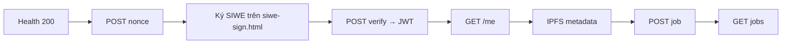

# Hướng dẫn test API Production trên Railway (tiếng Việt)

Tài liệu này hướng dẫn **từng bước** kiểm thử backend Fapex đã deploy trên Railway — không cần chạy MongoDB/Docker local.

**URL production (mẫu team):**

```
https://fapex-backend-production.up.railway.app
```

> **Khác với test local:** Bạn gọi API qua HTTPS public, ký SIWE trên `https://…/siwe-sign.html`, và dùng `domain`/`uri` từ response nonce (khớp biến Railway `SIWE_DOMAIN` / `APP_URL`).

---

## Tổng quan luồng



| Bước | API | Cần gì |
|------|-----|--------|
| 0 | Chuẩn bị | MetaMask Sepolia, REST Client hoặc Postman Desktop |
| 1 | `GET /health` | Không cần auth |
| 2 | `POST /api/auth/nonce` | MongoDB Atlas trên Railway |
| 3 | Ký SIWE | MetaMask — trang production `siwe-sign.html` |
| 4 | `POST /api/auth/verify` | Message + chữ ký từ bước 3 |
| 5 | `GET /api/auth/me` | JWT từ verify |
| 6 | `POST /api/ipfs/upload/metadata` | JWT + Pinata (env Railway) |
| 7 | `POST /api/jobs` | JWT + Pinata + RPC Sepolia |
| 8 | `GET /api/jobs` | Public — chỉ cần MongoDB |

---

## Phần A — Điều kiện tiên quyết

### A.1. Phần mềm

| Phần mềm | Mục đích |
|----------|----------|
| [MetaMask](https://metamask.io/) | Ví Sepolia, ký SIWE |
| Extension **REST Client** (`humao.rest-client`) hoặc [Postman Desktop](https://www.postman.com/downloads/) | Gọi API |
| Chrome (khuyến nghị) | Mở `siwe-sign.html` qua HTTPS |

### A.2. Biến môi trường trên Railway (đã cấu hình bởi team deploy)

Bạn **không** sửa file `.env` local — chỉ cần biết các giá trị phải **khớp** khi ký SIWE:

| Biến Railway | Giá trị mong đợi (production) |
|--------------|-------------------------------|
| `SIWE_DOMAIN` | `fapex-backend-production.up.railway.app` (hostname, **không** có `https://`) |
| `APP_URL` | `https://fapex-backend-production.up.railway.app` |
| `CHAIN_ID` | `11155111` (Sepolia) |
| `MONGODB_URI` | Atlas — health phải báo `mongodb: connected` |
| `JWT_SECRET`, `PINATA_JWT`, `RPC_URL` | Cần cho verify / IPFS / tạo job |

Chi tiết deploy: [deploy-backend.md](./deploy-backend.md).

---

## Phần B — Smoke test không cần ví (Health)

### B.1. curl / PowerShell

```powershell
curl.exe https://fapex-backend-production.up.railway.app/health
```

### B.2. Kết quả mong đợi (200)

```json
{
  "status": "ok",
  "environment": "production",
  "mongodb": "connected",
  "websocket": { "enabled": true, "path": "/socket.io", "auth": "JWT (SIWE login token)" }
}
```

| Trường | Ý nghĩa |
|--------|---------|
| `mongodb: connected` | Tiếp tục test nonce/auth |
| `mongodb: disconnected` | Kiểm tra Atlas + `MONGODB_URI` trên Railway (xem deploy guide) |

---

## Phần C — Chọn công cụ gọi API

### Cách 1 — REST Client (khuyến nghị trong Cursor)

1. Cài extension **REST Client** (`humao.rest-client`)
2. Mở `backend/api-tests.http`
3. Cuộn tới section **Production — Railway**
4. Sửa biến:
   - `@walletAddressProd` — địa chỉ ví Sepolia (EIP-55)
   - `@authTokenProd` — dán JWT sau bước verify
5. Gửi lần lượt: `01-prod` → `02-prod` → … (sau khi ký SIWE: `03b-prod`)

### Cách 2 — Postman Desktop

1. Import `backend/postman/Fapex.postman_collection.json`
2. Tạo environment mới hoặc duplicate **Fapex — Local**:
   - `baseUrl` = `https://fapex-backend-production.up.railway.app`
   - `walletAddress` = ví Sepolia
3. Chạy cùng thứ tự như local — xem [postman-walkthrough-vi.md](./postman-walkthrough-vi.md)

> **Không dùng** extension Postman trong VS Code/Cursor — thường lỗi import collection.

---

## Phần D — Luồng đầy đủ (có ví)

### Bước 1 — Health

REST Client: `### 01-prod — GET /health` → **Send Request**

### Bước 2 — Nonce

1. Đặt `@walletAddressProd` = địa chỉ MetaMask Sepolia
2. Gửi `### 02-prod — POST /api/auth/nonce`

**Response 200 (ví dụ):**

```json
{
  "success": true,
  "nonce": "a1b2c3d4...",
  "walletAddress": "0x523eBd853a1638065f148A05c0Ca423E490D92f7",
  "domain": "fapex-backend-production.up.railway.app",
  "appUrl": "https://fapex-backend-production.up.railway.app",
  "chainId": 11155111
}
```

Lưu `nonce`, `domain`, `appUrl`, `chainId` — phải khớp message khi ký.

### Bước 3 — Ký SIWE trên production (bắt buộc MetaMask)

1. Mở Chrome, mạng **Sepolia**
2. Truy cập:

   ```
   https://fapex-backend-production.up.railway.app/siwe-sign.html
   ```

3. Xác nhận banner **SIWE Sign Page v4** — nếu thiếu: hard refresh `Ctrl+Shift+R`
4. **Kết nối MetaMask** → địa chỉ trùng `@walletAddressProd`
5. **Lấy nonce từ API** (hoặc dán nonce từ bước 2)
6. Kiểm tra:
   - `domain` = `fapex-backend-production.up.railway.app`
   - `uri` = `https://fapex-backend-production.up.railway.app`
   - `chainId` = `11155111`
   - Địa chỉ ví **EIP-55 checksum** (trang v4 tự chuẩn hóa)
7. **Ký với MetaMask** → **Copy JSON cho Postman**

> MetaMask **không** hoạt động với `file://`. Luôn dùng URL HTTPS của Railway.

### Bước 4 — Verify → JWT

**Cách khuyến nghị (REST Client):**

```bash
cd backend
cp verify-body.json.example verify-body-prod.json
```

Dán nguyên JSON từ nút **Copy JSON cho Postman** vào `verify-body-prod.json` → gửi `### 03b-prod`.

**Response 200:**

```json
{
  "success": true,
  "token": "eyJhbGciOiJIUzI1NiIs...",
  "user": { "walletAddress": "0x...", ... }
}
```

Copy `token` → `@authTokenProd` (hoặc Postman `authToken`).

**Placeholder `03-prod`:** Chỉ dùng khi đã escape message SIWE một dòng (`\n`). Ưu tiên `03b-prod`.

### Bước 5 — GET /api/auth/me

Gửi `### 04-prod` với `Authorization: Bearer {{authTokenProd}}`.

Response 200 → JWT hợp lệ.

### Bước 6 — Upload metadata IPFS

Gửi `### 05-prod` — cần Pinata (`PINATA_JWT` trên Railway).

Response thành công: `metadataCID` (ví dụ `Qm...`).

### Bước 7 — Tạo job

Gửi `### 06-prod` — cần JWT, MongoDB, Pinata, `RPC_URL` Sepolia.

### Bước 8 — Danh sách jobs

Gửi `### 07-prod` — public, không cần auth.

---

## Phần E — Xử lý sự cố (production)

| Triệu chứng | Nguyên nhân | Cách sửa |
|-------------|-------------|----------|
| Health 200 nhưng `mongodb: disconnected` | Atlas URI / Network Access | Railway Variables → `MONGODB_URI`; Atlas → allow `0.0.0.0/0` tạm thời |
| `SIWE verification failed` | `domain`/`uri`/`nonce` sai | Gọi nonce mới trên **cùng** URL production; ký lại trên `siwe-sign.html` production |
| `Domain does not match` | `SIWE_DOMAIN` chưa cập nhật | Trên Railway: `SIWE_DOMAIN=fapex-backend-production.up.railway.app`, `APP_URL=https://fapex-backend-production.up.railway.app` → redeploy |
| `Invalid or expired nonce` | Nonce cũ / gọi nonce hai lần | POST nonce lại → ký lại ngay |
| `Bad control character in string literal` | Message nhiều dòng trong JSON | Dùng `03b-prod` + `verify-body-prod.json` hoặc Postman pre-request script |
| IPFS / POST job lỗi | Thiếu Pinata hoặc RPC | Kiểm tra `PINATA_JWT`, `RPC_URL` trên Railway |
| CORS từ frontend | `ALLOWED_ORIGINS` | Thêm URL frontend production vào Railway |

---

## Phần F — Checklist hoàn tất (tự làm)

- [ ] `curl.exe https://fapex-backend-production.up.railway.app/health` → 200, `mongodb: connected`
- [ ] Mở `https://fapex-backend-production.up.railway.app/siwe-sign.html` — banner v4
- [ ] `POST /api/auth/nonce` → 200, `domain`/`appUrl` đúng Railway
- [ ] Ký SIWE MetaMask → **Copy JSON**
- [ ] `POST /api/auth/verify` → 200 + JWT
- [ ] `GET /api/auth/me` → 200
- [ ] `POST /api/ipfs/upload/metadata` → `metadataCID` (nếu test IPFS)
- [ ] `POST /api/jobs` → job tạo thành công (nếu test on-chain)
- [ ] `GET /api/jobs` → danh sách JSON

---

## Tài liệu liên quan

- [postman-walkthrough-vi.md](./postman-walkthrough-vi.md) — luồng local chi tiết (cùng pattern, khác `baseUrl`)
- [deploy-backend.md](./deploy-backend.md) — deploy và biến môi trường Railway
- `backend/api-tests.http` — section **Production — Railway**
