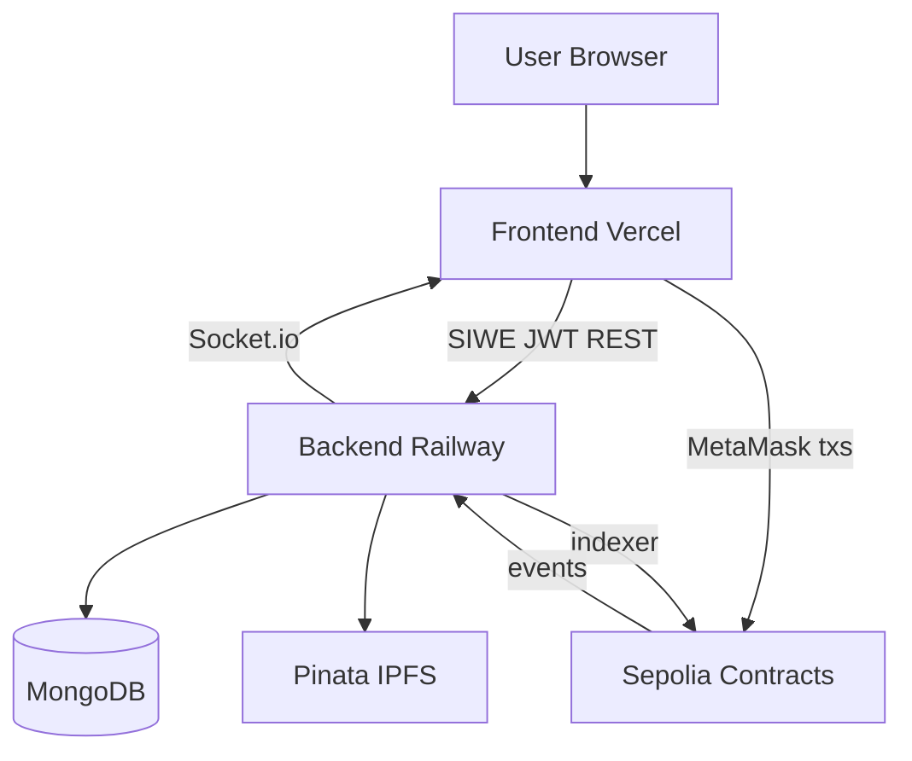

# Báo cáo dự án — FAPEX

> **English summary:** Academic-style project report outline for a Web3 freelance escrow platform on Sepolia, covering motivation, architecture, implementation, security, demo results, and future work.

**Đồ án / Khóa luận · Cập nhật:** 2026-06-28

---

## PHẦN 1 — Giới thiệu

### 1.1 Bối cảnh

Thị trường freelance toàn cầu phụ thuộc nền tảng tập trung (Upwork, Fiverr) với phí cao, thanh toán chậm và tranh chấp do bên thứ ba quyết định. **FAPEX** đề xuất mô hình escrow on-chain: tiền khóa trong smart contract, giải phóng khi client phê duyệt hoặc theo ruling arbitrator có stake.

### 1.2 Mục tiêu

1. Xây dựng escrow USDC (MockUSDC trên Sepolia) với phí nền tảng minh bạch
2. Luồng job đầy đủ: đăng → bid → nạp tiền → giao hàng → phê duyệt / tranh chấp
3. Cơ chế tranh chấp lấy cảm hứng Kleros: evidence, commit–reveal, appeal
4. Backend indexer đồng bộ chain → MongoDB cho UX; chain vẫn là nguồn sự thật
5. Frontend wallet-native: SIWE, không password

### 1.3 Phạm vi

- **Trong phạm vi:** Sepolia testnet, MockUSDC, 5 arbitrator panel, demo dispute windows (phút)
- **Ngoài phạm vi v1:** Mainnet, USDC thật, Chainlink VRF production, The Graph

---

## PHẦN 2 — Khảo sát & công nghệ

### 2.1 So sánh giải pháp

| Tiêu chí | Nền tảng tập trung | FAPEX Web3 |
|----------|-------------------|------------|
| Escrow | Tài khoản platform | Smart contract `EscrowVault` |
| Identity | Email/password | SIWE (ví Ethereum) |
| Dispute | Support ticket | On-chain arbitrator panel |
| File | Server riêng | IPFS (Pinata) + CID on-chain |

### 2.2 Tech stack

Xem chi tiết: [tech-stack-vi.md](tech-stack-vi.md)

| Lớp | Stack |
|-----|-------|
| Contracts | Solidity 0.8.20, Hardhat, OpenZeppelin patterns |
| Chain | Ethereum Sepolia (11155111) |
| Backend | Node.js, Express, MongoDB, Socket.io, ethers indexer |
| Frontend | Vite, React 19, wagmi, RainbowKit, Tailwind |
| Storage | Pinata IPFS |
| Oracle | Chainlink (documented; VRF v2 deferred) |

---

## PHẦN 3 — Thiết kế hệ thống

### 3.1 Kiến trúc tổng quan

### 3.2 Smart contracts

| Contract | Trách nhiệm |
|----------|-------------|
| `MockUSDC` | Token 6 decimals, `mint()` permissionless cho demo |
| `JobRegistry` | `createJob`, proposals, status, deliverable CID |
| `EscrowVault` | `depositEscrow` (fee 3%), release, dispute, appeal |
| `ArbitratorPanel` | Pool, sortition, evidence hash, commit–reveal vote |
| `PlatformTreasury` | Stake 50 USDC, slash, reward arbitrator |
| `ReputationStore` | Soulbound score (default 100), tier |

**Phí on-chain:**
- Platform fee deposit: **3%**
- Service fee release: **2%**
- Dispute fee: **2%** (cap 50 USDC)
- Appeal fee: **~1.3×** dispute fee

### 3.3 Luồng nghiệp vụ

Xem: [workflow-e2e-vi.md](workflow-e2e-vi.md) · [on-chain-off-chain-map-vi.md](on-chain-off-chain-map-vi.md)

### 3.4 Tranh chấp

| Phase (demo) | Thời gian từ `raiseDispute` |
|--------------|----------------------------|
| Evidence initial | 0 → 5 phút |
| Evidence rebuttal | 5 → 10 phút |
| Commit vote | 10 → 13 phút |
| Reveal vote | 13 → 16 phút |
| Appeal window | 30 phút sau finalize |

Production (`DisputeTimings.prod`): 72h / 120h / 144h / 168h / appeal 72h.

So sánh Kleros: [dispute-kleros-comparison-vi.md](dispute-kleros-comparison-vi.md)

---

## PHẦN 4 — Triển khai

### 4.1 Deploy Sepolia (2026-06-27)

| Contract | Address |
|----------|---------|
| MockUSDC | `0x2293193Eaa5CE5253d5e081046a06dB077f26f8e` |
| JobRegistry | `0x302629f82d51b0972ffc3A99cbE355F4acEf908d` |
| EscrowVault | `0x5f8C4c552F49103cA84dF455571155C8268C2aF5` |
| ArbitratorPanel | `0x490Afc952af85aB0dEb375Bd36A65db5E1F47418` |
| PlatformTreasury | `0x666aF0Ec040377026E0D40870Bce7c165f741530` |
| ReputationStore | `0x5e457db6a8A44C143180043c5Bb7223C7222898E` |

Legacy JobRegistry (job cũ): `0xE5425cFE21BAe73d54138Bb290B671bF4c55FBC9`

### 4.2 Production

| Thành phần | URL |
|------------|-----|
| Backend | https://fapex-backend-production.up.railway.app |
| Frontend | Vercel (`*.vercel.app`) |
| CORS | `ALLOWED_ORIGINS=https://*.vercel.app,...` |

### 4.3 Backend indexer

- Checkpoint `IndexerState.lastBlock` — không mất block khi restart
- Events: `JobCreated`, `EscrowDeposited`, `WorkSubmitted`, `DisputeRaised`, `DisputeSetup`, `EvidenceSubmitted`, `DisputeFinalized`, ...
- Toggle: `ENABLE_EVENT_INDEXER=false` khi test Postman local

---

## PHẦN 5 — Bảo mật & kiểm thử

### 5.1 Biện pháp

- CEI trong payout escrow
- Commit–reveal chống vote copying
- Stake gate + slash no-reveal (5 USDC + rep −10)
- `setPaused` emergency trên EscrowVault
- SIWE domain binding (`SIWE_DOMAIN`, `APP_URL`)

### 5.2 Kiểm thử

- Hardhat: `npm test` (24+ test cases, prod timings)
- Manual E2E Sepolia: [demo-script-vi.md](demo-script-vi.md)
- API: [postman-walkthrough-vi.md](postman-walkthrough-vi.md)

### 5.3 Audit matrix

[issue-audit-status-vi.md](issue-audit-status-vi.md)

---

## PHẦN 6 — Kết quả & demo

### 6.1 Chức năng đã hoàn thành

- [x] SIWE login + role registration
- [x] Create job (client-signed on-chain + IPFS metadata)
- [x] Off-chain bids + accept
- [x] Escrow deposit + work submission
- [x] Approve release + timeout claim
- [x] Full dispute flow với 5 arbitrator
- [x] Arbitrator stake + seed script
- [x] Event indexer + Socket.io notifications
- [x] Production Railway + Vercel

### 6.2 Hạn chế đã biết

- MongoDB cache có thể lag vài phút so với chain (indexer poll)
- Không có coherent vote penalty như Kleros
- `prevrandao` sortition — không VRF production
- Reviews API placeholder

---

## PHẦN 7 — Hướng phát triển

1. **Chainlink VRF v2** — sortition arbitrator verifiable random
2. **The Graph subgraph** — public query thay một phần indexer
3. **Mainnet** — USDC thật, prod dispute timings
4. **Multi-chain** — CCIP (roadmap)
5. **On-chain governance** — đổi dispute windows không redeploy

---

## PHẦN 8 — Kết luận

FAPEX chứng minh khả năng xây dựng nền tảng freelance Web3 end-to-end: escrow minh bạch, tranh chấp có cơ chế kinh tế (stake/slash), và UX hiện đại qua SIWE + wagmi. Hệ thống production trên Sepolia phục vụ demo và đánh giá; roadmap v2 bổ sung VRF và indexing phi tập trung hơn.

---

## Tài liệu tham khảo nội bộ

- [overview-vi.md](overview-vi.md)
- [system-design-vi.md](system-design-vi.md)
- [demo-qa-defense-vi.md](demo-qa-defense-vi.md)
- [legal/freelance-terms.md](../legal/freelance-terms.md)
