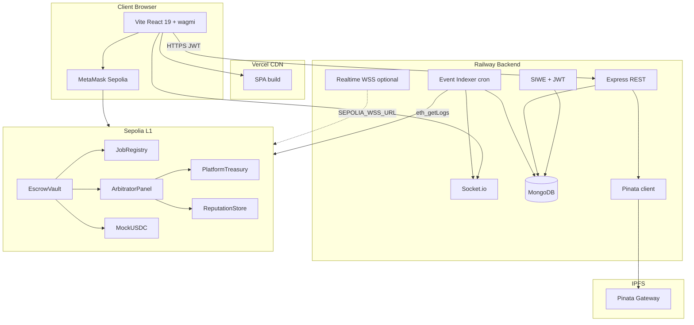
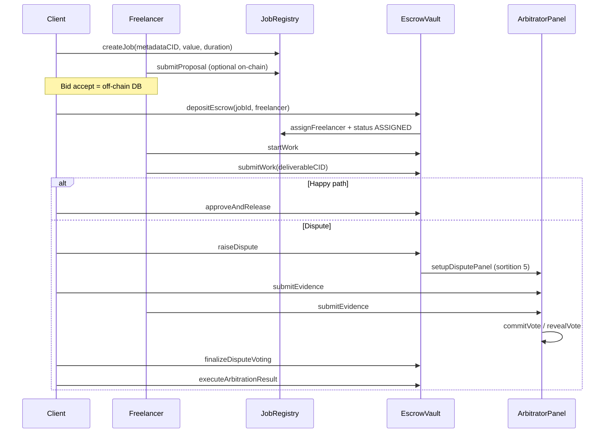
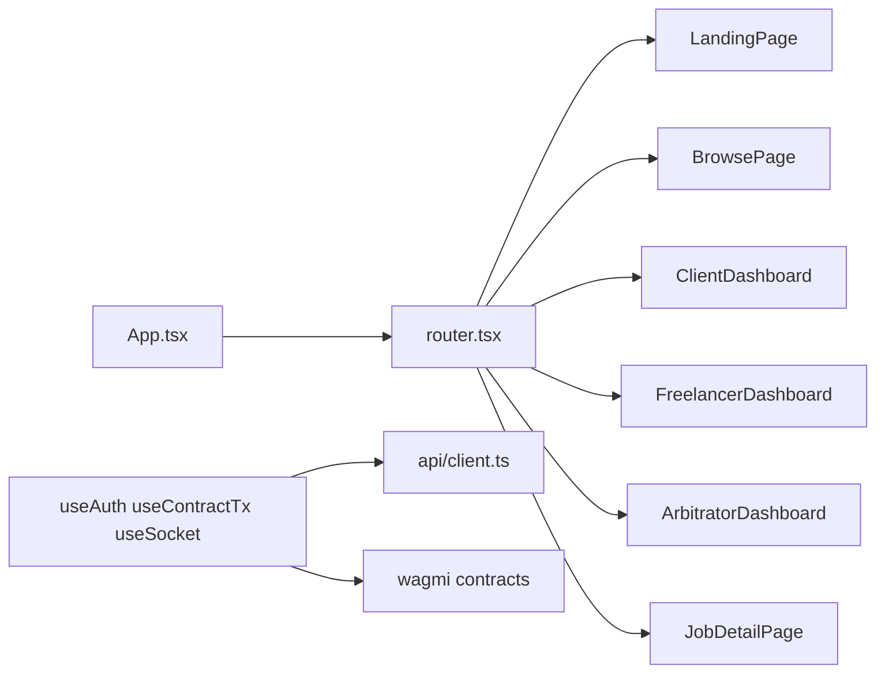
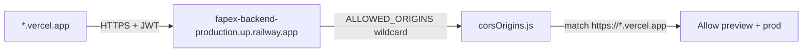
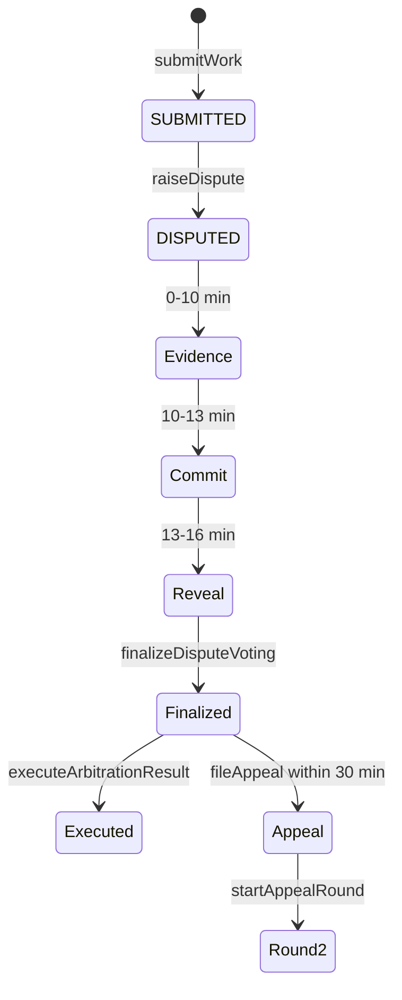

# Thiết kế hệ thống — FAPEX

> **English summary:** Three-tier Web3 dApp — React client, Express indexer/API on Railway, six Solidity contracts on Sepolia. MongoDB caches events; IPFS stores files; Socket.io pushes updates.

**Cập nhật:** 2026-06-30

---

## 1. Kiến trúc tổng quan



---

## 2. Phân lớp trách nhiệm

| Lớp | Thư mục | Trách nhiệm |
|-----|---------|-------------|
| **Presentation** | `frontend/` | UI, wallet connect, gửi tx, đọc contract view, Socket.io client |
| **Application API** | `backend/src/routes/` | Auth, CRUD jobs/bids/disputes, IPFS upload proxy |
| **Indexing** | `backend/src/services/blockchain/` | Poll events, cập nhật MongoDB, emit notifications |
| **Domain (on-chain)** | `contracts/` | Escrow, dispute, reputation — **source of truth** |
| **Storage** | Pinata | File deliverable, metadata JSON, evidence |

---

## 3. Smart contract interactions



### Authorization graph

```
EscrowVault ──authorized──► JobRegistry, ArbitratorPanel, PlatformTreasury, ReputationStore
ArbitratorPanel ──authorized──► PlatformTreasury, ReputationStore
Admin ──► setAuthorizedContract, joinPool (arbitrator), setPaused, adminForceResolve
```

---

## 4. Backend components

### 4.1 Entry points

| File | Vai trò |
|------|---------|
| `backend/src/server.js` | HTTP server + Socket.io attach |
| `backend/src/app.js` | Express middleware, CORS, routes |
| `backend/src/services/blockchain/eventIndexer.js` | Cron poll `eth_getLogs` |
| `backend/src/services/blockchain/realtimeListener.js` | Optional WSS subscription |
| `backend/src/services/notifications/socketService.js` | JWT rooms `wallet:*`, `job:*` |

### 4.2 MongoDB models

| Model | Mục đích |
|-------|----------|
| `User` | wallet, username, role, nonce, reputation cache |
| `Job` | compound key `(onchainJobId, jobRegistryAddress)` |
| `Bid` | off-chain proposals |
| `Dispute` | evidence metadata, arbitrator list mirror |
| `IndexerState` | `lastBlock` checkpoint |

### 4.3 jobScope (sau redeploy)

Mọi query job scoped theo `JOB_REGISTRY_ADDRESS` env. Job cũ từ registry trước redeploy dùng `LEGACY_JOB_REGISTRY_ADDRESS`:

```
LEGACY_JOB_REGISTRY_ADDRESS=0xE5425cFE21BAe73d54138Bb290B671bF4c55FBC9
```

Migration: `backend/scripts/migrate-job-registry-index.js`

---

## 5. Frontend architecture



**Guards:** `RoleGuard` — client / freelancer / arbitrator (stake ≥50 USDC).

**Mismatch UX:** `WalletMismatchBanner` khi MetaMask ≠ on-chain party.

---

## 6. CORS & production networking



`backend/src/utils/corsOrigins.js` hỗ trợ:
- Exact origin: `https://fapex.vercel.app`
- Wildcard: `https://*.vercel.app`, `*.vercel.app`

Railway env example:
```
ALLOWED_ORIGINS=http://localhost:3000,https://*.vercel.app
```

---

## 7. Dispute state machine



---

## 8. Nguồn sự thật (source of truth)

| Dữ liệu | Authority |
|---------|-----------|
| Escrow balance, job status enum | **On-chain** |
| Dispute votes, evidence hash | **On-chain** |
| Reputation score | **On-chain** `ReputationStore` |
| Job title, description, skills | MongoDB + IPFS JSON |
| Bids | MongoDB (accept = DB; chain optional) |
| Evidence CID plaintext | MongoDB + IPFS (hash on-chain) |
| User display name | MongoDB |

---

## 9. v2 roadmap

| Thành phần | Thay thế |
|------------|----------|
| Custom indexer poll | The Graph subgraph + gateway |
| `prevrandao` sortition | Chainlink VRF callback |
| Manual `executeArbitrationResult` | Keeper / automation |

Xem: [chainlink-integration-vi.md](chainlink-integration-vi.md) · [demo-qa-defense-vi.md](demo-qa-defense-vi.md)
