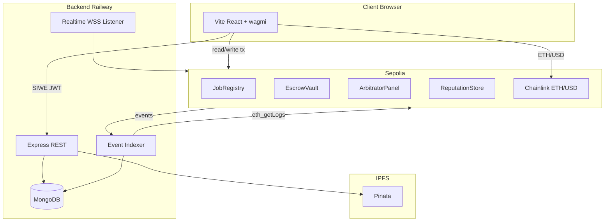

# Thiết kế hệ thống — FAPEX (VI)

## Lớp

1. **Presentation:** `frontend/` — RainbowKit MetaMask, landing, dashboards
2. **API:** `backend/` — auth, jobs, bids, IPFS proxy, arbitrator status
3. **Indexer:** `eventIndexer.js` — batch poll, `IndexerState.lastBlock` checkpoint
4. **Contracts:** escrow 3% fee, dispute commit-reveal, reputation soulbound

## Cấu hình

- `GET /health` — contracts env, MongoDB
- `GET /api/config` — addresses cho frontend (FE-5)
- `deployments/sepolia.json` — địa chỉ canonical

## v2

- The Graph thay một phần indexer cho query công khai
- Chainlink VRF thay `prevrandao` sortition
