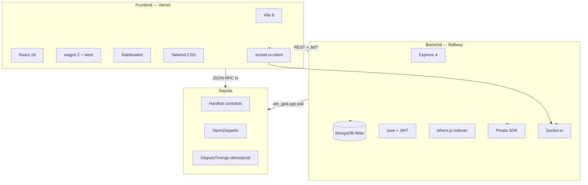

# FAPEX — Tech stack & mục đích từng công nghệ

> **English summary:** Layered stack — Solidity/Hardhat on Sepolia, Node/Express + MongoDB indexer, React 19 + wagmi frontend. Chainlink Price Feed is documented but not shown live in UI (v2: VRF sortition).

**Cập nhật:** 2026-06-28

---

## Sơ đồ tổng thể

---

## 1. Smart contracts

| Công nghệ | Phiên bản / ghi chú | Mục đích trong FAPEX |
|-----------|---------------------|----------------------|
| **Solidity** | `^0.8.20` | 6 contract chính trong `FreelanceSystem.sol` + `MockUSDC.sol` |
| **Hardhat** | 2.22.x | Compile, test, deploy Sepolia, export ABI |
| **OpenZeppelin** | IERC20 patterns | USDC interface, access patterns |
| **ethers.js** | v6 (scripts) | Deploy, seed arbitrators, verify Etherscan |
| **DisputeTimings** | `demo` / `prod` library | Cửa sổ tranh chấp — copy qua `prepare-dispute-timings.js` trước compile |

**Scripts quan trọng (root):**

| npm script | Mục đích |
|------------|----------|
| `npm run compile` | Compile + auto export ABI → backend + frontend |
| `npm run deploy:sepolia` | Deploy với **demo** timings |
| `npm run deploy:sepolia:prod` | Deploy với **prod** timings (72h windows) |
| `npm run seed:arbitrators` | Mint/stake/join 5 arbitrator cho pool |
| `npm run check:dispute` | Đọc pool size + trạng thái dispute on-chain |

---

## 2. Chainlink (tích hợp & roadmap)

| Thành phần | Trạng thái | Mục đích |
|------------|------------|----------|
| **ETH/USD Price Feed** | Feed Sepolia `0x694AA1769357215DE4FAC081bf1f309aDC325306` — **không hiển thị live trên UI** (đã gỡ để giảm RPC calls) | Landing vẫn ghi "Oracle: Chainlink" — roadmap hiển thị gas USD |
| **VRF sortition** | **Deferred v2** | Thay `block.prevrandao` khi chọn 5 arbitrator |
| **VRFSortitionStub.sol** | Interface stub, chưa deploy | Thiết kế callback VRF |
| **CCIP / Functions** | Không trong v1 | — |

Chi tiết: [chainlink-integration-vi.md](chainlink-integration-vi.md)

---

## 3. Backend

| Công nghệ | Mục đích |
|-----------|----------|
| **Node.js + Express** | REST API: auth, users, jobs, bids, disputes, IPFS proxy |
| **MongoDB** | Cache jobs, bids, users, disputes — **không** là nguồn sự thật escrow |
| **Mongoose** | Schema: `User`, `Job`, `Bid`, `Dispute`, `IndexerState` |
| **siwe** (package) | EIP-4361 Sign-In With Ethereum → JWT 7 ngày |
| **ethers.js** | Event indexer (`eth_getLogs`), optional WSS realtime listener |
| **node-cron** | Poll indexer mỗi ~2 phút (`IndexerState.lastBlock`) |
| **Pinata** | `pinFileToIPFS`, `pinJSONToIPFS` — deliverable & metadata |
| **Socket.io** | Push `job:updated`, `dispute:*` sau indexer |
| **cors** + `corsOrigins.js` | Wildcard `https://*.vercel.app` cho preview Vercel |

**Biến môi trường chính:** `MONGODB_URI`, `RPC_URL`, `JWT_SECRET`, `SIWE_DOMAIN`, `APP_URL`, `INDEXER_PRIVATE_KEY`, contract addresses, `ALLOWED_ORIGINS`, Pinata keys.

Chi tiết deploy: [deploy-backend.md](deploy-backend.md) · Auth: [auth-api.md](auth-api.md)

---

## 4. Frontend

| Công nghệ | Mục đích |
|-----------|----------|
| **Vite** | Dev server port 3000, build production cho Vercel |
| **React 19** | SPA, lazy routes, role dashboards |
| **TypeScript** | Type-safe hooks & API client |
| **wagmi 2 + viem** | Đọc contract, gửi tx MetaMask |
| **RainbowKit** | Connect wallet UI |
| **TanStack Query** | Cache API + on-chain reads |
| **Tailwind CSS** | Light/dark theme, responsive layout |
| **socket.io-client** | Realtime job/dispute updates |
| **i18n** | UI tiếng Anh (không có locale VI trên production) |

**Trang chính:** Landing, Browse, Client/Freelancer/Arbitrator dashboards, Job detail, Profile.

**Env:** `VITE_API_URL`, `VITE_*_ADDRESS` (sync `deployments/sepolia.json`), optional RPC fallback.

---

## 5. Hạ tầng & DevOps

| Dịch vụ | Vai trò |
|---------|---------|
| **Railway** | Host backend Docker, env secrets, health check `/health` |
| **MongoDB Atlas** | Production database (hoặc Railway plugin) |
| **Vercel** | Host frontend static, env per branch/preview |
| **Pinata** | IPFS pinning gateway |
| **Infura / public RPC** | Sepolia JSON-RPC + optional WSS |
| **Etherscan** | `npm run verify:sepolia` |

---

## 6. Bảo mật & patterns

| Pattern | Ứng dụng |
|---------|----------|
| **SIWE + JWT** | Không lưu password; wallet = identity |
| **CEI (Checks-Effects-Interactions)** | Payout escrow tránh reentrancy |
| **Commit–reveal vote** | Arbitrator không copy vote lẫn nhau |
| **Stake + slash** | 50 USDC stake; slash 5 USDC nếu commit không reveal |
| **jobScope** | `(onchainJobId, jobRegistryAddress)` — tránh collision sau redeploy |
| **Pause / adminForceResolve** | Emergency + quorum fail |

---

## 7. Deferred v2

| Hạng mục | Lý do chưa làm v1 |
|----------|-------------------|
| Chainlink VRF | Chi phí subscription + độ phức tạp; `prevrandao` đủ demo Sepolia |
| The Graph | Custom indexer đủ cho thesis; subgraph khi scale |
| Mainnet USDC | Sepolia MockUSDC permissionless mint |
| On-chain governance timings | Cần redeploy hoặc proxy pattern |
