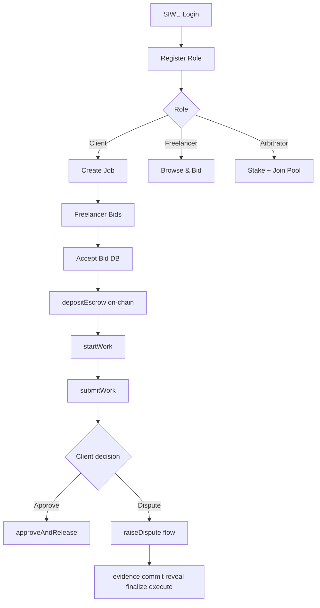
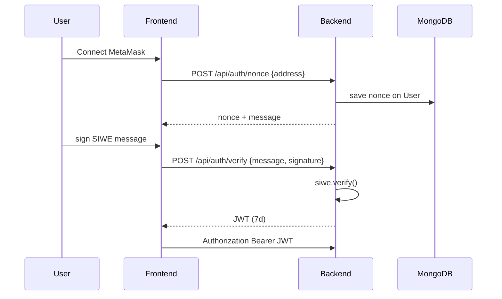
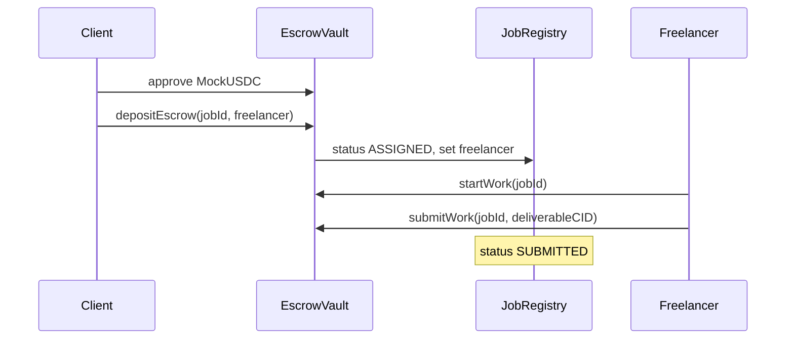
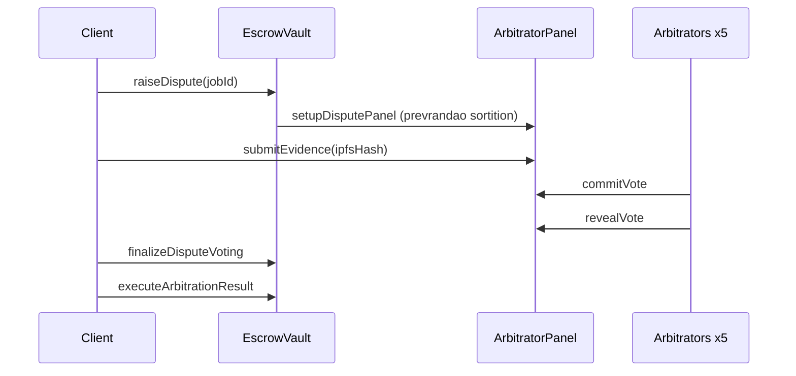
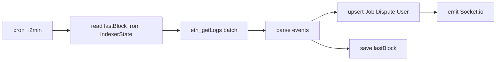

# Luồng E2E nội bộ — FAPEX

> **English summary:** End-to-end workflows for Client, Freelancer, Arbitrator, and backend indexer — with source-of-truth table.

**Cập nhật:** 2026-06-30

---

## Sơ đồ tổng thể

---

## 1. Authentication (SIWE → JWT)

**Files:** `backend/src/controllers/authController.js`, `frontend/src/hooks/useAuth.ts`

---

## 2. Client — đăng job

| # | Hành động | On-chain | Off-chain |
|---|-----------|----------|-----------|
| 1 | Upload metadata JSON | — | `POST /api/ipfs/upload/metadata` → Pinata |
| 2 | `createJob(metadataCID, value, duration)` | ✅ Client ký MetaMask | — |
| 3 | Register job record | — | `POST /api/jobs` + JWT |
| 4 | Indexer sync | Event `JobCreated` | MongoDB upsert |

**Lưu ý:** `onchainClientAddress` = ví ký `createJob` (không phải INDEXER trừ relay demo).

---

## 3. Freelancer — bid & được chọn

| # | Hành động | On-chain | Off-chain |
|---|-----------|----------|-----------|
| 1 | Submit bid | Optional `submitProposal` | `POST /api/bids` |
| 2 | Client accept | — | `PATCH /api/bids/:id/accept` |
| 3 | Reject other bids | — | `updateMany` pending → rejected |

**Quan trọng:** Accept bid **không** gọi `assignFreelancer` on-chain. Freelancer được gán khi `depositEscrow(jobId, freelancerAddress)`.

---

## 4. Escrow & làm việc

| Tx | Ai ký | Gas note |
|----|-------|----------|
| `depositEscrow` | Client | Approve USDC trước |
| `startWork` | Freelancer | — |
| `submitWork` | Freelancer | Upload IPFS → CID |

---

## 5. Happy path — phê duyệt

| # | Tx | Kết quả |
|---|-----|---------|
| 1 | `approveAndRelease(jobId)` | USDC → freelancer (trừ service fee 2%) |
| 2 | Indexer `FundsReleased` | MongoDB COMPLETED, stats freelancer |

Timeout: client không phản hồi sau review period → **bất kỳ ai** gọi `claimTimeoutRelease` (permissionless).

### 4b. Freelancer không nộp deliverable

| Trạng thái | Hành động client |
|------------|------------------|
| ASSIGNED, FL không `startWork` sau **72h** | `cancelContract` — hoàn full deposit |
| IN_PROGRESS, chưa `submitWork` | `raiseDispute` (không có auto-refund theo `deadline`) |
| SUBMITTED, không phản hồi **7 ngày** | Chờ hoặc `claimTimeoutRelease` |

`deadline` từ `createJob` **không** enforce trong `submitWork`. Chi tiết: [platform-mechanisms-vi.md](platform-mechanisms-vi.md).

---

## 6. Dispute flow

### 6.1 Timeline demo (Sepolia hiện tại)

| Phase | Thời gian | Hành động |
|-------|-----------|-----------|
| Evidence initial | 0–5 min | Client/Freelancer `submitEvidence` |
| Evidence rebuttal | 5–10 min | Phản bác |
| Commit | 10–13 min | Arbitrator `commitVote(hash)` |
| Reveal | 13–16 min | Arbitrator `revealVote(choice, salt)` |
| Finalize | sau 16 min | `finalizeDisputeVoting` |
| Appeal | 30 min window | `fileAppeal` → round 2 |
| Execute | sau appeal | `executeArbitrationResult` |

**Pool:** disputes cần **≥5**; appeals khuyến nghị **≥10** (loại arb vòng 1).

### 6.3 Kết quả SPLIT 50-50

Khi majority = SPLIT (hoặc hòa FL/Client): `executeArbitrationResult` → `_splitAndPayout(50%)` + `_handleSplitDisputeFee` (50% fee hoàn initiator, không thưởng arb).

### 6.4 Appeal

`fileAppeal` → phí **1.3×** → `startAppealRound` (5 arb mới) → lặp timeline → execute sau finalize vòng 2.

### 6.5 Sequence

**Điều kiện:** `poolSize ≥ 5` — `npm run seed:arbitrators`

---

## 7. Arbitrator workflow

| # | Bước | Contract |
|---|------|----------|
| 1 | Mint MockUSDC | `MockUSDC.mint` |
| 2 | Approve + stake | `PlatformTreasury.stakeAsArbitrator(50e6)` |
| 3 | Join pool | `ArbitratorPanel.joinPool` (hoặc admin) |
| 4 | Được chọn khi dispute | `setupDisputePanel` |
| 5 | Vote | `commitVote` → `revealVote` |
| 6 | No reveal penalty | Slash 5 USDC + rep −10 |

Dashboard: `/arbitrator` · Job detail: `ArbitratorDisputePanel`

---

## 8. Backend indexer workflow

**Toggle:** `ENABLE_EVENT_INDEXER=false` — local Postman only

**Chain = truth:** `isChainStatusAhead()` reconcile DB khi chain tiến hơn.

---

## 9. Nguồn sự thật

| Dữ liệu | Authority |
|---------|-----------|
| Escrow balance, job status, dispute votes | **On-chain** |
| Title, description, skills | MongoDB + IPFS |
| Bids | MongoDB |
| File deliverable | IPFS (CID on-chain) |
| Reputation score | `ReputationStore` on-chain |
| Evidence CID readable | MongoDB hydrate + IPFS gateway |

Chi tiết mapping: [on-chain-off-chain-map-vi.md](on-chain-off-chain-map-vi.md)

---

## 10. Internal ops checklist

| Sự kiện | Hành động dev |
|---------|---------------|
| Redeploy contracts | Update env Railway + Vercel + `migrate-job-registry-index.js` |
| Pool empty | `npm run seed:arbitrators` |
| ABI thay đổi | `npm run compile` (auto export) |
| CORS preview fail | Thêm `https://*.vercel.app` Railway |
