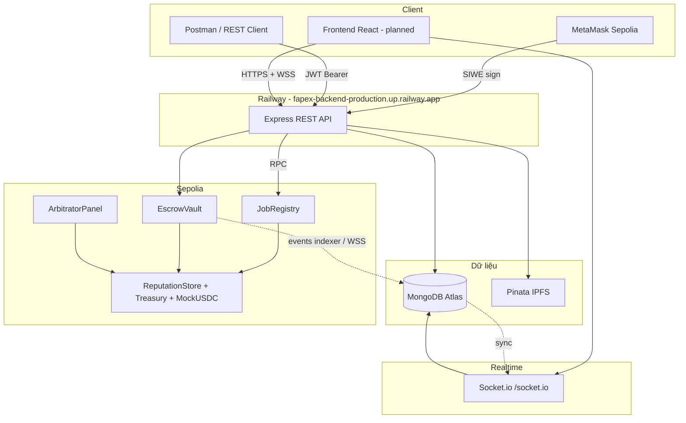

# Báo cáo tiến độ — Contributor 2 (Backend & DevOps)

> **Dự án:** Fapex — nền tảng freelance phi tập trung (escrow USDC, trọng tài on-chain)  
> **Cập nhật:** 2026-06-24  
> **Phạm vi:** Xác thực ví, tài liệu QA, deploy production, thông báo realtime

---

## 1. Tổng quan dự án Fapex

Fapex là hệ thống freelance kết hợp **smart contract trên Sepolia** và **backend Node.js**:

| Thành phần | Vai trò |
|------------|---------|
| **On-chain** | 6 contract: `JobRegistry`, `EscrowVault`, `ArbitratorPanel`, `PlatformTreasury`, `ReputationStore`, `MockUSDC` — quản lý job, escrow, tranh chấp, phí, uy tín |
| **Backend** | REST API (Express), MongoDB (cache off-chain), IPFS (Pinata), đồng bộ event từ chain |
| **Frontend** | React + ví (kế hoạch) — submodule đang chờ tích hợp SIWE và Socket.io |

Luồng MVP: client tạo job on-chain → freelancer đề xuất off-chain → client `depositEscrow` → làm việc → nghiệm thu hoặc tranh chấp. MongoDB mirror trạng thái; **chain là source of truth**.

---

## 2. Contributor 2 đã bàn giao

### 2.1 SIWE + JWT (Task 1)

- Đăng nhập bằng ví Ethereum (EIP-4361 Sign-In with Ethereum).
- Endpoints: `POST /api/auth/nonce`, `POST /api/auth/verify`, `GET /api/auth/me`.
- Middleware bảo vệ route tạo job, bid, upload IPFS.
- Trang helper production: `https://fapex-backend-production.up.railway.app/siwe-sign.html` (v4, EIP-55).

**Tài liệu:** [auth-api.md](../guides/auth-api.md)

### 2.2 Hướng dẫn test local & Postman (Task 2)

- Hướng dẫn tiếng Việt từng bước: health → nonce → ký MetaMask → verify → API có JWT.
- Hỗ trợ **REST Client** (`backend/api-tests.http`), **Postman Desktop**, PowerShell — tránh extension Postman lỗi import trên VS Code/Cursor.
- Collection và environment: `backend/postman/`.
- Troubleshooting: MongoDB Docker Windows, Infura rate limit (`ENABLE_EVENT_INDEXER=false`), SIWE JSON newline.

**Tài liệu:** [postman-testing.md](../guides/postman-testing.md), [postman-walkthrough-vi.md](../guides/postman-walkthrough-vi.md)

### 2.3 Deploy Railway production (Task 3)

- Backend deploy từ repo [blockchain-backend](https://github.com/thanhltkk24414-lang/blockchain-backend), nhánh `main`, Docker + `railway.toml`.
- **URL production:** [https://fapex-backend-production.up.railway.app](https://fapex-backend-production.up.railway.app)
- Health: `GET /health` (MongoDB, websocket status).
- Biến môi trường: Atlas, Infura, Pinata, 6 địa chỉ Sepolia, `JWT_SECRET`, `SIWE_DOMAIN`, `APP_URL`, `ALLOWED_ORIGINS`.

**Tài liệu:** [deploy-backend.md](../guides/deploy-backend.md)

### 2.4 WebSocket Socket.io (Task 4)

- Kết nối realtime sau khi có JWT (`auth: { token }` trên handshake).
- Server → client: `connected`, `job:updated`, `escrow:deposited`, `escrow:released`, `job:created`, `dispute:opened`, …
- Client → server: `subscribe:job` / `unsubscribe:job` theo `onchainJobId`.
- CORS Socket.io dùng chung `ALLOWED_ORIGINS` với REST.

**Tài liệu:** mục 7.5 trong [deploy-backend.md](../guides/deploy-backend.md)

---

## 3. Kiến trúc triển khai (production)

| Endpoint | Mục đích |
|----------|----------|
| `https://fapex-backend-production.up.railway.app/health` | Kiểm tra server, MongoDB, websocket |
| `https://fapex-backend-production.up.railway.app/siwe-sign.html` | Demo đăng nhập ví |
| `https://fapex-backend-production.up.railway.app/api/auth/*` | Nonce, verify, profile |
| `wss://fapex-backend-production.up.railway.app/socket.io` | Thông báo job/escrow (cần JWT) |

---

## 4. Hướng dẫn demo cho buổi thuyết trình

### Chuẩn bị (2–3 phút trước)

1. MetaMask chuyển sang **Sepolia**, có một ít ETH testnet.
2. Mở URL production (không dùng `localhost` khi demo deploy).
3. (Tùy chọn) Import Postman collection hoặc mở `api-tests.http`.

### Kịch bản demo đề xuất (~10 phút)

| Bước | Hành động | Minh chứng cho giảng viên |
|------|-----------|---------------------------|
| 1 | `GET /health` | JSON `status: ok`, `mongodb: connected`, `websocket.enabled: true` |
| 2 | Mở `/siwe-sign.html` → Connect MetaMask → Lấy nonce → Ký | Hiển thị domain Railway, `chainId: 11155111` |
| 3 | `POST /api/auth/verify` (hoặc nút copy JSON trên trang) | Nhận JWT `token` |
| 4 | `GET /api/auth/me` với `Authorization: Bearer ...` | Trả về `walletAddress`, role |
| 5 | (Nếu có Pinata) `POST /api/ipfs/upload/metadata` với JWT | Nhận `metadataCID` |
| 6 | (Nâng cao) Kết nối Socket.io với JWT, `subscribe:job` | Console log event `job:updated` khi có thay đổi on-chain |

**Slide gợi ý:** screenshot health JSON, SIWE sign page, Postman verify 200, (tùy chọn) Etherscan tx `createJob` / `depositEscrow` từ [contract-interaction.md](../guides/contract-interaction.md).

### Lưu ý khi trình bày

- Nếu Infura báo rate limit: giải thích `ENABLE_EVENT_INDEXER=false` trên free tier — auth/API vẫn chạy; indexer là tùy chọn cho demo đồng bộ.
- Nhấn mạnh **phân tách trách nhiệm**: contract (owner/C1), backend auth+deploy (C2), frontend (bước tiếp theo).

---

## 5. Công việc còn lại

| Hạng mục | Mức ưu tiên | Mô tả |
|----------|-------------|-------|
| **Tích hợp frontend** | Cao | RainbowKit + SIWE flow gọi production API; lưu JWT; gọi REST jobs/bids; kết nối Socket.io cho thông báo job |
| **Wire UI vote / arbitrator** | Trung bình | `GET /api/arbitrator/:address/status` + flow dispute (theo ma trận task-split) |
| **Event indexer / WSS** | Tùy chọn | Bật `ENABLE_EVENT_INDEXER=true` hoặc `SEPOLIA_WSS_URL` khi cần demo chain → MongoDB → socket realtime |
| **Cron `claimTimeoutRelease`** | Owner backend | Scaffold `src/cron/claimTimeout.js` — cần `INDEXER_PRIVATE_KEY` |

---

## 6. Tài liệu liên quan

| Tài liệu | Nội dung |
|----------|----------|
| [task-split.md](../guides/task-split.md) | Ma trận phân công + bảng tiến độ task 1–4 |
| [auth-api.md](../guides/auth-api.md) | SIWE + JWT |
| [deploy-backend.md](../guides/deploy-backend.md) | Railway, env vars, WebSocket |
| [postman-walkthrough-vi.md](../guides/postman-walkthrough-vi.md) | Test API đầy đủ |
| [contract-interaction.md](../guides/contract-interaction.md) | Tương tác contract Sepolia |
| [report-outline-suggestions.md](./report-outline-suggestions.md) | Gợi ý outline báo cáo học thuật |

---

*Báo cáo này phục vụ phần trình bày Contributor 2 trong đồ án Fapex — backend production-ready cho auth, QA và realtime notifications.*
