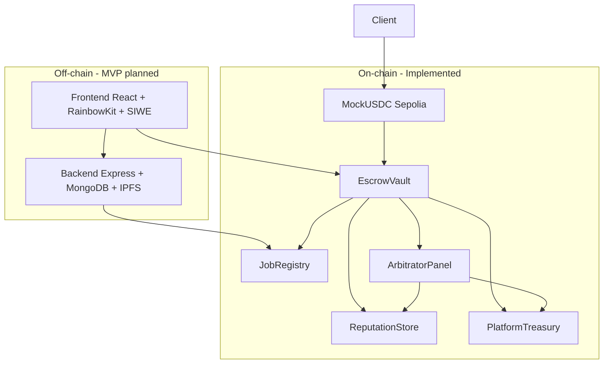

# Gợi ý điều chỉnh outline báo cáo (PHẦN 4 & 5)

> Dựa trên trạng thái thực tế repo `Blockchain` tại thời điểm 2026-06-22.

## Tóm tắt nhanh

| Mục outline | Khớp dự án? | Ghi chú |
|-------------|-------------|---------|
| 4.1 Giao diện | **Một phần** | Frontend submodule gần như trống (chỉ README) |
| 4.2 Blockchain | **Khớp tốt** | Smart contract + Sepolia đã deploy; UI ví chưa có |
| 4.3 Backend | **Một phần** | Scaffold có, logic/API thực tế còn placeholder |
| 5.1 Unit test | **Khớp** | 24/24 passing — xem `unit-test-output.txt` |
| 5.2 Deploy Sepolia | **Khớp** | `deployments/sepolia.json` + `scripts/deploy.js` |
| 5.3 Demo | **Cần bổ sung** | Demo on-chain qua script/ethers, chưa có UI |
| 5.4 Đánh giá | **Khớp** | Phân tích MVP vs planned |

---

## PHẦN 4 — đề xuất bổ sung

### 4.0 Kiến trúc monorepo (mới — nên thêm trước 4.1)

- Repo chính + 4 git submodule: `contracts`, `frontend`, `backend`, `docs`
- Smart contract compile/test ở root; deploy script `scripts/deploy.js`

### 4.1 Giao diện người dùng

**Giữ:** Client, Freelancer, Admin (dispute, stats, complaints)

**Điều chỉnh:** Ghi rõ **thiết kế / kế hoạch** vs **đã triển khai**:
- Đã có: tài liệu pháp lý (`docs/legal/freelance-terms.md`), hướng dẫn tương tác contract
- Chưa có: React UI, RainbowKit, SIWE (chỉ mô tả trong legal doc)

**Bổ sung màn hình theo luồng on-chain:**
- Job board (OPEN) → Proposal list → Deposit assign
- Workspace IN_PROGRESS / SUBMITTED
- Dispute panel (evidence, commit–reveal vote) cho Arbitrator
- Admin: pause, grantRole, force resolve

### 4.2 Kết nối blockchain

**Giữ:** MetaMask, tx workflow Approve → Deposit → Start/Submit → Release, IPFS CID on-chain

**Sửa tên hàm:** `claimAfterTimeout()` → **`claimTimeoutRelease(jobId)`** (sau 7 ngày SUBMITTED)

**Bổ sung bắt buộc:**
- **5 contract:** ReputationStore, PlatformTreasury, JobRegistry, ArbitratorPanel, EscrowVault
- **MockUSDC** Sepolia (`mint()` public, 6 decimals)
- **Role model:** `admin`, `authorizedContracts`, delegated `grantRole` (ROLE_PAUSER, ROLE_FORCE_RESOLVER, ROLE_ARBITRATOR_MANAGER)
- **Phí:** platform 3%, service 2%, dispute 2% (cap 50 USDC)
- **State machine job:** OPEN → ASSIGNED → IN_PROGRESS → SUBMITTED → COMPLETED / DISPUTED / REFUNDED / CANCELLED
- **Gap MVP:** không có `acceptProposal()` on-chain — client chọn freelancer qua địa chỉ khi `depositEscrow`

### 4.3 Backend

**Giữ (như mục tiêu):** REST jobs/ratings/profiles, MongoDB sync, cron, WebSocket

**Thực tế hiện tại — ghi phân lớp MVP:**
- Có: Express scaffold, models (User, Job, Bid, Dispute, Review), IPFS service stub, route definitions
- Chưa hoàn thiện: controllers trả `"Coming soon"`, event indexer placeholder, routes chưa mount trong `app.js`, không có WebSocket trong `src/`

**Bổ sung nên mô tả:**
- Event sync từ `JobCreated`, `EscrowDeposited`, `DisputeRaised`, `FundsReleased`, …
- Reputation tier mirror off-chain (Restricted / Warning / Normal / Trusted)
- Cron gọi `claimTimeoutRelease` cho job quá hạn (backend helper, không phải tên hàm contract)

---

## PHẦN 5 — đề xuất bổ sung

### 5.1 Unit test smart contract ✅

- 24 test cases, file `test/FreelanceSystem.test.js`
- Nhóm: JobRegistry, Escrow happy path, Cancellation, Dispute, Pause, Treasury, Reputation, Admin, Delegated roles
- Screenshot: `docs/report/unit-test-output.txt`

### 5.2 Deploy Sepolia testnet ✅

- `npm run deploy:sepolia` → `deployments/sepolia.json`
- 6 địa chỉ (MockUSDC + 5 contract), wiring `setAuthorizedContract`
- Etherscan verify (nếu có `ETHERSCAN_API_KEY`)

### 5.3 Demo nghiệp vụ

**Luồng happy path:** createJob → submitProposal → depositEscrow → startWork → submitWork → approveAndRelease

**Luồng dispute (nên có — điểm khác biệt dự án):**
- raiseDispute → submitEvidence → commitVote / revealVote → finalizeDispute → executeArbitrationResult
- Appeal round 2 (nếu demo đủ thời gian)

**Minh chứng:** Etherscan tx, event logs, Sepolia addresses, (tùy chọn) script ethers từ `contract-interaction.md`

### 5.4 Đánh giá kiểm thử

| Tiêu chí | Kết quả |
|----------|---------|
| Unit test on-chain | 24/24 pass |
| Integration UI | Chưa có |
| Backend API | Scaffold |
| Sepolia E2E manual | Có thể qua script |
| Dispute / reputation | Covered in unit tests |

**Hạn chế MVP:** frontend/backend off-chain; proposal acceptance off-chain; messaging/revision off-chain (theo thiết kế).

---

## Sơ đồ kiến trúc gợi ý cho báo cáo

